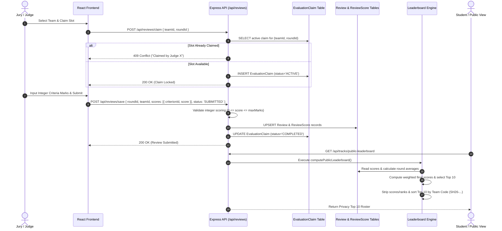
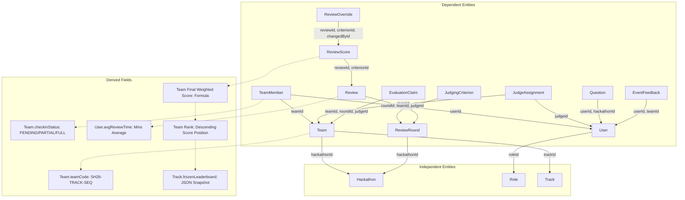
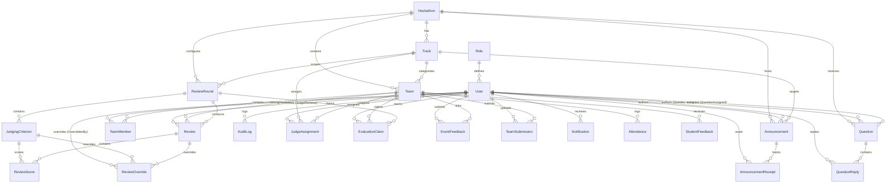
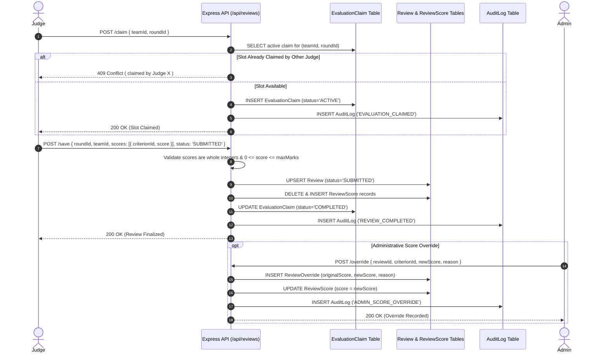
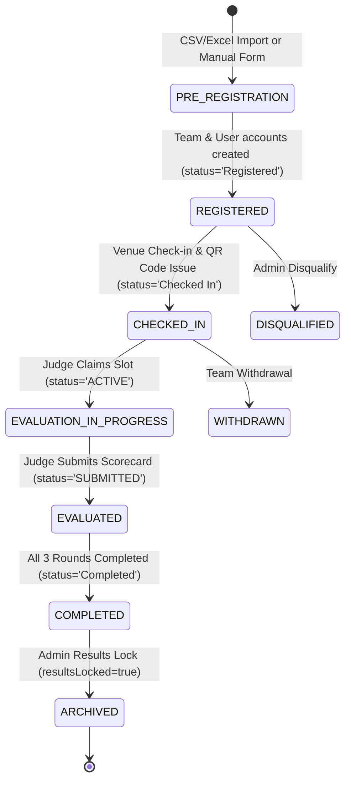

# Complete Database Data Flow & Classification Audit

**Application:** SmartHorizon University Hackathon Operations Portal  
**Database Engine:** SQLite (via Prisma ORM v5)  
**Audit Conducted:** August 26, 2026  
**Auditor:** Senior Database Architect + Backend Systems Analyst + Data Governance Engineer  

---

## 1. Executive Summary

A complete, empirical audit of the SmartHorizon Hackathon Operations Portal codebase was conducted across backend Express/Prisma API services, React frontend interfaces, seed scripts, import pipelines, and utility sync mechanisms.

### Key Architectural Insights
1. **Core Data Contract**: The application manages a multi-tenant hackathon operations ecosystem spanning **24 relational entities** in SQLite. Data flows from registration Excel imports and student/judge web forms through JWT-authenticated Express endpoints into SQLite via Prisma, and is consumed by role-restricted React dashboards, real-time Server-Sent Events (SSE), PDF/Excel generators, and background credentials sync scripts.
2. **Scoring & Evaluation Integrity**: Evaluations operate on a **3-Round Rubric model** with strict integer scoring validation (`0 <= score <= maxMarks`). The system implements atomic evaluation claims (`EvaluationClaim`) to prevent concurrent judging collisions and maintains an immutable audit trail of administrative score overrides (`ReviewOverride`).
3. **Privacy & Anonymization Engine**: Student endpoints enforce strict anonymization rules: judge identities are anonymized to `"Anonymous Judge"` / `"Judge N"`, and public/student leaderboards strip all raw scores and ranks, rendering only an alphanumerically sorted roster of top 10 team codes (`computePublicLeaderboard`).
4. **Denormalization & State Sync**: Heavy field duplication exists between `Team` (e.g. flat lead/member fields like `leadName`, `leadEmail`, `leadMobile`, `leadUsn`) and `TeamMember` / `User` tables. A background sync worker (`credentialsSync.ts`) unidirectionally updates `Login_credentials_participants.md` whenever student passwords change.

---

## 2. System Architecture & Diagrams

### A. High-Level System Architecture Diagram

```mermaid
graph TD
    subgraph Client Layer (React 18 SPA)
        SD[Student Dashboard & Workspace]
        JD[Judge Evaluation Console & Pool]
        AD[Admin Control Center & Mission Control]
        PL[Public Privacy Leaderboard UI]
    end

    subgraph Gateway & Middleware Layer (Express.js)
        AuthMW[Auth Middleware: JWT Verify & Role Gate]
        ZodVal[Zod Input Validation Engine]
        ROUTER[Express API Route Handlers]
    end

    subgraph Service & Core Logic Layer
        QRServ[QR Code Generator & Verification Service]
        ScoreEngine[Evaluation & Atomic Claim Engine]
        LeadEngine[Leaderboard & Weighted Ranking Engine]
        FileServ[PDF Upload & Magic-Byte Validation]
        ExpEngine[Excel & CSV Import/Export Engine]
        SSEServ[Real-Time SSE Notification Broadcast]
        SyncWorker[Credentials Sync Background Worker]
    end

    subgraph Data & Storage Layer (SQLite + Disk)
        Prisma[Prisma ORM Client v5]
        SQLite[(SQLite DB: backend/database.db)]
        UploadFS[Disk Storage: /uploads/submissions/]
        CredFS[Disk File: Login_credentials_participants.md]
    end

    Client Layer -->|HTTPS REST APIs & Bearer JWT| AuthMW
    AuthMW --> ZodVal
    ZodVal --> ROUTER

    ROUTER --> ScoreEngine
    ROUTER --> LeadEngine
    ROUTER --> QRServ
    ROUTER --> FileServ
    ROUTER --> ExpEngine
    ROUTER --> SSEServ

    ScoreEngine --> Prisma
    LeadEngine --> Prisma
    QRServ --> Prisma
    FileServ --> UploadFS
    ExpEngine --> Prisma
    SyncWorker --> CredFS

    Prisma --> SQLite
    SSEServ -.->|Server-Sent Events: /api/notifications/feed| Client Layer
```

### B. End-to-End Evaluation & Ranking Data Flow Diagram



### C. Layer-by-Layer Architectural Breakdown

1. **Frontend Presentation Layer (`frontend/src/`)**:
   - Built with **React 18**, **TypeScript**, **TailwindCSS**, and **Lucide icons**.
   - State management handles authenticated sessions (`AuthContext.tsx`), track filtering (`TrackContext.tsx`), real-time SSE alerts (`NotificationCenter.tsx`), and offline evaluation draft backups (`localStorage`).
2. **API Routing & Security Middleware (`backend/src/routes/` & `middleware/`)**:
   - Express server utilizing JSON Web Tokens (JWT) for stateless authentication.
   - `authenticateToken` extracts Bearer tokens; `requireRole(['ADMINISTRATOR', 'JUDGE'])` restricts endpoint execution.
   - Zod validation schemas enforce type safety and whole-integer scoring rules before database execution.
3. **Business Logic & Service Layer (`backend/src/utils/` & `routes/`)**:
   - **Atomic Evaluation Claim Engine**: Coordinates `EvaluationClaim` locks to prevent double-judging race conditions.
   - **Leaderboard Engine (`computeLeaderboard` & `computePublicLeaderboard`)**: Calculates multi-round weighted averages ($\frac{\sum \text{Score} \times \text{Weight}}{\sum \text{Weight}}$), dense rankings, movement delta indicators, and strips scores for student/public privacy.
   - **File & Export Services**: Magic-byte PDF inspection (`%PDF-`), A4 printable QR badge generator (`pdfkit`), ZIP exporter (`adm-zip`), and Excel/CSV parser (`xlsx`) with formula injection protection (`sanitizeCsvCell`).
4. **Persistence & Storage Layer (`backend/prisma/` & `backend/uploads/`)**:
   - Prisma ORM v5 interfacing with SQLite file `database.db`.
   - File uploads persisted under `backend/uploads/submissions/`.
   - Automatic participant credentials sync worker writing to `Login_credentials_participants.md`.

---

## 3. Database Entities

| Entity / Table | Purpose | Primary Key | Foreign Keys | Main Data Owner | Public Data | Private Data | Dependencies |
| :--- | :--- | :--- | :--- | :--- | :--- | :--- | :--- |
| **`Hackathon`** | Event container & global dates | `id` (UUID) | None | Admin | `name`, `description`, dates, `active` | None | None |
| **`Role`** | RBAC definition (`ADMINISTRATOR`, `JUDGE`, `STUDENT`) | `id` (VARCHAR) | None | System | `id`, `name` | None | None |
| **`User`** | System accounts & credentials | `id` (UUID) | `roleId` | User / Admin | `name`, `judgeStatus` | `email`, `phone`, `avgReviewTime` | `Role` |
| **`Track`** | Domain / theme track & leaderboard rules | `id` (UUID) | `hackathonId` | Admin | `name` | `frozenLeaderboard` | `Hackathon` |
| **`Team`** | Participating team, lead details, workspace & check-in | `id` (UUID) | `trackId`, `hackathonId` | Team Lead / Admin | `name`, `teamCode`, `college`, `domain`, `projectTitle` | `leadEmail`, `leadMobile`, `leadUsn`, member details | `Track`, `Hackathon` |
| **`TeamMember`** | Individual student team membership | `id` (UUID) | `teamId`, `userId` | Team Lead | `name`, `role` | `email`, `phone` | `Team`, `User` |
| **`JudgeAssignment`** | Admin assignment of judge to team queue | `id` (UUID) | `judgeId`, `teamId`, `trackId` | Admin | None | None | `User`, `Team`, `Track` |
| **`EvaluationClaim`** | Atomic lock holding judge-team round slot | `id` (UUID) | `teamId`, `roundId`, `judgeId` | Judge / System | None | `status`, `claimedAt` | `Team`, `ReviewRound`, `User` |
| **`ReviewRound`** | Evaluation phase configuration & thresholds | `id` (UUID) | `trackId`, `hackathonId` | Admin | `name`, `sequence`, `duration` | Rubric thresholds | `Hackathon`, `Track` |
| **`JudgingCriterion`** | Specific scoring rubric line item | `id` (UUID) | `roundId` | Admin | `name`, `description`, `maxMarks` | Weighting formula | `ReviewRound` |
| **`Review`** | Top-level evaluation session record | `id` (UUID) | `roundId`, `teamId`, `judgeId` | Judge | None | `comments`, `status`, durations | `ReviewRound`, `Team`, `User` |
| **`ReviewScore`** | Criterion-level integer marks awarded | `id` (UUID) | `reviewId`, `criterionId` | Judge | None | `score` | `Review`, `JudgingCriterion` |
| **`ReviewOverride`** | Admin score override audit history | `id` (UUID) | `reviewId`, `criterionId`, `changedById` | Admin | None | `originalScore`, `newScore`, `reason` | `Review`, `JudgingCriterion`, `User` |
| **`Question`** | Help desk support ticket | `id` (UUID) | `hackathonId`, `userId`, `assignedToId` | Student / Admin | None | `title`, `content`, `internalNotes` | `Hackathon`, `User` |
| **`QuestionReply`** | Support ticket thread message | `id` (UUID) | `questionId`, `userId` | Author / Admin | None | `content` | `Question`, `User` |
| **`Announcement`** | Global/targeted broadcast bulletin | `id` (UUID) | `hackathonId`, `trackId`, `authorId` | Admin | `title`, `content`, `category`, `publishAt` | Target audience rules | `Hackathon`, `Track`, `User` |
| **`AnnouncementReceipt`** | Read / Acknowledgement tracking per user | `id` (UUID) | `announcementId`, `userId` | User | None | `status` | `Announcement`, `User` |
| **`Attendance`** | Member/team check-in log entry | `id` (UUID) | `teamId`, `memberId` | Admin / System | None | `checkedInBy`, timestamp | `Team`, `TeamMember` |
| **`StudentFeedback`** | Legacy round rating from student | `id` (UUID) | `teamId`, `studentId`, `roundId` | Student | None | `rating`, `comments` | `Team`, `User`, `ReviewRound` |
| **`JuryFeedback`** | Operational feedback from judge | `id` (UUID) | `judgeId`, `roundId` | Judge | None | `category`, `comments` | `User`, `ReviewRound` |
| **`EventFeedback`** | 10-parameter post-event survey | `id` (UUID) | `userId`, `teamId` | User | None | Ratings (Q1-Q10), `avgRating`, `comments` | `User`, `Team` |
| **`TeamSubmission`** | PDF presentation / document upload | `id` (UUID) | `teamId`, `uploadedById` | Team Lead | None | `pdfUrl`, `originalName`, `fileSize` | `Team`, `User` |
| **`Notification`** | User-facing alert notification | `id` (UUID) | `userId` | System | None | `title`, `content`, `type`, `read` | `User` |
| **`AuditLog`** | Immutable system action audit trail | `id` (UUID) | `userId` | System / Admin | None | Action details, IP address, previous/new states | `User` |

---

## 4. Master Data Dictionary

Below is the complete inventory of all 118 attributes across the 24 database tables.

> **Legend**:  
> - **Direction**: PUSH (Write-only/Input), PULL (Read-only/Output), PUSH + PULL (Read/Write), DERIVED (Calculated)  
> - **Privacy**: PUBLIC, INTERNAL, PRIVATE, RESTRICTED, SECRET  
> - **Status**: **[CONFIRMED]** (Direct code evidence), **[INFERRED]** (Implementation logic), **[UNKNOWN]** (Requires confirmation)

| Field | Table | Description | Data Type | Semantic Type | Direction | Dependency | Privacy | Access Role | Required? | Nullable? | Default | PK? | FK? | Unique? | Mutable? | Source | Consumer | Stored/Derived |
| :--- | :--- | :--- | :--- | :--- | :--- | :--- | :--- | :--- | :--- | :--- | :--- | :--- | :--- | :--- | :--- | :--- | :--- | :--- |
| `id` | `Hackathon` | Hackathon UUID **[CONFIRMED]** | `TEXT` | `identifier` | PUSH + PULL | INDEPENDENT | PUBLIC | Admin | Yes | No | `uuid()` | Yes | No | Yes | No | Backend | System / APIs | Stored |
| `name` | `Hackathon` | Hackathon title **[CONFIRMED]** | `TEXT` | `free_text` | PUSH + PULL | INDEPENDENT | PUBLIC | Admin | Yes | No | None | No | No | No | Yes | Admin Form | UI / Reports | Stored |
| `description` | `Hackathon` | Event details **[CONFIRMED]** | `TEXT` | `free_text` | PUSH + PULL | INDEPENDENT | PUBLIC | Admin | No | Yes | None | No | No | No | Yes | Admin Form | UI | Stored |
| `startDate` | `Hackathon` | Start timestamp **[CONFIRMED]** | `DATETIME` | `timestamp` | PUSH + PULL | INDEPENDENT | PUBLIC | Admin | Yes | No | None | No | No | No | Yes | Admin Form | UI | Stored |
| `endDate` | `Hackathon` | End timestamp **[CONFIRMED]** | `DATETIME` | `timestamp` | PUSH + PULL | INDEPENDENT | PUBLIC | Admin | Yes | No | None | No | No | No | Yes | Admin Form | UI | Stored |
| `active` | `Hackathon` | Active flag **[CONFIRMED]** | `BOOLEAN` | `flag` | PUSH + PULL | INDEPENDENT | PUBLIC | Admin | Yes | No | `false` | No | No | No | Yes | Admin Form | System / Queries | Stored |
| `createdAt` | `Hackathon` | Creation timestamp **[CONFIRMED]** | `DATETIME` | `timestamp` | PUSH + PULL | System | INTERNAL | System | Yes | No | `now()` | No | No | No | No | System | System | Stored |
| `updatedAt` | `Hackathon` | Update timestamp **[CONFIRMED]** | `DATETIME` | `timestamp` | PUSH + PULL | System | INTERNAL | System | Yes | No | `updatedAt` | No | No | No | Yes | System | System | Stored |
| `id` | `Role` | Role ID (ADMINISTRATOR, JUDGE, STUDENT) **[CONFIRMED]** | `TEXT` | `identifier` | PUSH + PULL | INDEPENDENT | PUBLIC | System | Yes | No | None | Yes | No | Yes | No | Seed | Auth Middleware | Stored |
| `name` | `Role` | Human role name **[CONFIRMED]** | `TEXT` | `free_text` | PULL | INDEPENDENT | PUBLIC | All | Yes | No | None | No | No | No | No | Seed | UI | Stored |
| `id` | `User` | User UUID **[CONFIRMED]** | `TEXT` | `identifier` | PUSH + PULL | INDEPENDENT | PUBLIC | System | Yes | No | `uuid()` | Yes | No | Yes | No | System | Auth / APIs | Stored |
| `email` | `User` | Account email address **[CONFIRMED]** | `TEXT` | `email` | PUSH + PULL | INDEPENDENT | PRIVATE | User / Admin | Yes | No | None | No | No | Yes | Yes | Form / Import | Auth / Reports | Stored |
| `passwordHash` | `User` | Bcrypt password hash **[CONFIRMED]** | `TEXT` | `hash` | PUSH | INDEPENDENT | SECRET | System | Yes | No | None | No | No | No | Yes | Auth Form | Auth Middleware | Stored |
| `name` | `User` | User full name **[CONFIRMED]** | `TEXT` | `free_text` | PUSH + PULL | INDEPENDENT | PUBLIC | User / Admin | Yes | No | None | No | No | No | Yes | Form / Import | Dashboards | Stored |
| `phone` | `User` | Contact phone number **[CONFIRMED]** | `TEXT` | `phone_number` | PUSH + PULL | INDEPENDENT | PRIVATE | User / Admin | No | Yes | None | No | No | No | Yes | Form / Import | Admin Console | Stored |
| `mustChangePassword` | `User` | First-time password change prompt **[CONFIRMED]** | `BOOLEAN` | `flag` | PUSH + PULL | System | INTERNAL | User / Admin | Yes | No | `false` | No | No | No | Yes | Auth Route | Credentials Sync | Stored |
| `judgeStatus` | `User` | Judge operational state **[CONFIRMED]** | `TEXT` | `enum` | PUSH + PULL | INDEPENDENT | INTERNAL | Judge / Admin | Yes | No | `"Available"` | No | No | No | Yes | Judge UI | Mission Control | Stored |
| `avgReviewTime` | `User` | Average evaluation time (mins) **[CONFIRMED]** | `REAL` | `duration` | PUSH + PULL | DERIVED | INTERNAL | Admin | Yes | No | `0.0` | No | No | No | Yes | System | Dashboard Stats | Stored |
| `currentTeamId` | `User` | Team currently being evaluated **[CONFIRMED]** | `TEXT` | `foreign_key` | PUSH + PULL | DEPENDENT (`Team.id`) | INTERNAL | Judge / Admin | No | Yes | None | No | No | No | Yes | Claim API | Judge Console | Stored |
| `nextTeamId` | `User` | Next queued team ID **[CONFIRMED]** | `TEXT` | `foreign_key` | PUSH + PULL | DEPENDENT (`Team.id`) | INTERNAL | Admin | No | Yes | None | No | No | No | Yes | Queue API | Judge Console | Stored |
| `roleId` | `User` | Associated Role FK **[CONFIRMED]** | `TEXT` | `foreign_key` | PUSH + PULL | DEPENDENT (`Role.id`) | RESTRICTED | Admin / System | Yes | No | None | No | Yes | No | Yes | Form / Import | RBAC Middleware | Stored |
| `createdAt` | `User` | Creation timestamp **[CONFIRMED]** | `DATETIME` | `timestamp` | PUSH + PULL | System | INTERNAL | System | Yes | No | `now()` | No | No | No | No | System | User Info | Stored |
| `updatedAt` | `User` | Update timestamp **[CONFIRMED]** | `DATETIME` | `timestamp` | PUSH + PULL | System | INTERNAL | System | Yes | No | `updatedAt` | No | No | No | Yes | System | System | Stored |
| `id` | `Track` | Track UUID **[CONFIRMED]** | `TEXT` | `identifier` | PUSH + PULL | INDEPENDENT | PUBLIC | System | Yes | No | `uuid()` | Yes | No | Yes | No | System | APIs | Stored |
| `name` | `Track` | Track/Theme name **[CONFIRMED]** | `TEXT` | `free_text` | PUSH + PULL | INDEPENDENT | PUBLIC | Admin | Yes | No | None | No | No | No | Yes | Admin Form | UI / Reports | Stored |
| `hackathonId` | `Track` | Hackathon FK **[CONFIRMED]** | `TEXT` | `foreign_key` | PUSH + PULL | DEPENDENT (`Hackathon.id`) | INTERNAL | Admin | Yes | No | None | No | Yes | No | No | System | System | Stored |
| `resultsLocked` | `Track` | Frozen leaderboard state **[CONFIRMED]** | `BOOLEAN` | `flag` | PUSH + PULL | INDEPENDENT | INTERNAL | Admin | Yes | No | `false` | No | No | No | Yes | Admin API | Leaderboard API | Stored |
| `frozenLeaderboard` | `Track` | JSON snapshot of locked ranks **[CONFIRMED]** | `TEXT` | `json` | PUSH + PULL | DERIVED | INTERNAL | Admin | No | Yes | None | No | No | No | Yes | Lock API | Leaderboard API | Stored |
| `leaderboardVisibility` | `Track` | Visibility access level **[CONFIRMED]** | `TEXT` | `enum` | PUSH + PULL | INDEPENDENT | INTERNAL | Admin | Yes | No | `"ADMIN_ONLY"` | No | No | No | Yes | Admin API | Visibility Check | Stored |
| `exposeScoresToStudents` | `Track` | Expose raw scores to students flag **[CONFIRMED]** | `BOOLEAN` | `flag` | PUSH + PULL | INDEPENDENT | INTERNAL | Admin | Yes | No | `false` | No | No | No | Yes | Admin API | Student View | Stored |
| `createdAt` | `Track` | Creation timestamp **[CONFIRMED]** | `DATETIME` | `timestamp` | PUSH + PULL | System | INTERNAL | System | Yes | No | `now()` | No | No | No | No | System | System | Stored |
| `updatedAt` | `Track` | Update timestamp **[CONFIRMED]** | `DATETIME` | `timestamp` | PUSH + PULL | System | INTERNAL | System | Yes | No | `updatedAt` | No | No | No | Yes | System | System | Stored |
| `id` | `Team` | Team UUID **[CONFIRMED]** | `TEXT` | `identifier` | PUSH + PULL | INDEPENDENT | PUBLIC | System | Yes | No | `uuid()` | Yes | No | Yes | No | System | APIs | Stored |
| `registrationId` | `Team` | External Registration ID **[CONFIRMED]** | `TEXT` | `identifier` | PUSH + PULL | INDEPENDENT | PUBLIC | All | No | Yes | None | No | No | Yes | Yes | Import / Form | Badges / CSV | Stored |
| `name` | `Team` | Team Name **[CONFIRMED]** | `TEXT` | `free_text` | PUSH + PULL | INDEPENDENT | PUBLIC | All | Yes | No | None | No | No | No | Yes | Import / Form | UI / Badges | Stored |
| `teamCode` | `Team` | Venue Team Code (e.g. SH26-HC-001) **[CONFIRMED]** | `TEXT` | `identifier` | PUSH + PULL | DERIVED | PUBLIC | All | No | Yes | None | No | No | Yes | Yes | QR Generator | Badges / Scans | Stored |
| `qrCode` | `Team` | QR Code Payload String **[CONFIRMED]** | `TEXT` | `identifier` | PUSH + PULL | DERIVED | PUBLIC | All | No | Yes | None | No | No | No | Yes | Check-in API | Badges / Scans | Stored |
| `college` | `Team` | Legacy College Name **[CONFIRMED]** | `TEXT` | `free_text` | PUSH + PULL | INDEPENDENT | PUBLIC | All | No | Yes | None | No | No | No | Yes | Import / Form | UI / Reports | Stored |
| `collegeName` | `Team` | Canonical College Name **[CONFIRMED]** | `TEXT` | `free_text` | PUSH + PULL | INDEPENDENT | PUBLIC | All | No | Yes | None | No | No | No | Yes | Import / Form | UI / Reports | Stored |
| `domain` | `Team` | Team Domain / Theme **[CONFIRMED]** | `TEXT` | `free_text` | PUSH + PULL | INDEPENDENT | PUBLIC | All | No | Yes | None | No | No | No | Yes | Import / Form | UI / Submissions | Stored |
| `selectedPsId` | `Team` | Problem Statement ID **[CONFIRMED]** | `TEXT` | `identifier` | PUSH + PULL | DEPENDENT | PUBLIC | All | No | Yes | None | No | No | No | Yes | Import / Form | UI / Marksheets | Stored |
| `mentorName1` | `Team` | Assigned Mentor Name **[CONFIRMED]** | `TEXT` | `free_text` | PUSH + PULL | INDEPENDENT | INTERNAL | Admin / Team | No | Yes | None | No | No | No | Yes | Import / Form | Workspace UI | Stored |
| `emergencyContact` | `Team` | Emergency Contact Info **[CONFIRMED]** | `TEXT` | `phone_number` | PUSH + PULL | INDEPENDENT | PRIVATE | Admin / Lead | No | Yes | None | No | No | No | Yes | Form | Admin Console | Stored |
| `projectTitle` | `Team` | Project Title **[CONFIRMED]** | `TEXT` | `free_text` | PUSH + PULL | INDEPENDENT | PUBLIC | All | No | Yes | None | No | No | No | Yes | Student Lead | Dashboards | Stored |
| `problemStatement` | `Team` | Problem Statement text **[CONFIRMED]** | `TEXT` | `free_text` | PUSH + PULL | INDEPENDENT | PUBLIC | All | No | Yes | None | No | No | No | Yes | Student Lead | Dashboards | Stored |
| `projectDesc` | `Team` | Project description **[CONFIRMED]** | `TEXT` | `free_text` | PUSH + PULL | INDEPENDENT | PUBLIC | All | No | Yes | None | No | No | No | Yes | Student Lead | Dashboards | Stored |
| `projectUrl` | `Team` | Public GitHub Repo URL **[CONFIRMED]** | `TEXT` | `URL` | PUSH + PULL | INDEPENDENT | PUBLIC | All | No | Yes | None | No | No | No | Yes | Student Lead | Evaluation UI | Stored |
| `demoUrl` | `Team` | Live Demo Video / Deployment URL **[CONFIRMED]** | `TEXT` | `URL` | PUSH + PULL | INDEPENDENT | PUBLIC | All | No | Yes | None | No | No | No | Yes | Student Lead | Evaluation UI | Stored |
| `presentationUrl` | `Team` | Pitch Deck URL **[CONFIRMED]** | `TEXT` | `URL` | PUSH + PULL | INDEPENDENT | PUBLIC | All | No | Yes | None | No | No | No | Yes | Student Lead | Evaluation UI | Stored |
| `techStack` | `Team` | Tech stack tags **[CONFIRMED]** | `TEXT` | `free_text` | PUSH + PULL | INDEPENDENT | PUBLIC | All | No | Yes | None | No | No | No | Yes | Student Lead | Dashboards | Stored |
| `status` | `Team` | Operational evaluation status **[CONFIRMED]** | `TEXT` | `enum` | PUSH + PULL | INDEPENDENT | PUBLIC | All | Yes | No | `"Registered"` | No | No | No | Yes | System / Admin | Dashboards | Stored |
| `checkInStatus` | `Team` | Check-in status (PENDING, PARTIALLY_CHECKED_IN, FULLY_CHECKED_IN) **[CONFIRMED]** | `TEXT` | `enum` | PUSH + PULL | DERIVED | PUBLIC | All | Yes | No | `"PENDING"` | No | No | No | Yes | Attendance API | Attendance Roster | Stored |
| `locked` | `Team` | Workspace locked state **[CONFIRMED]** | `BOOLEAN` | `flag` | PUSH + PULL | INDEPENDENT | INTERNAL | Admin / Lead | Yes | No | `false` | No | No | No | Yes | Admin API | Edit Gate | Stored |
| `repoVisibility` | `Team` | GitHub repo visibility (PUBLIC/PRIVATE) **[CONFIRMED]** | `TEXT` | `enum` | PUSH + PULL | INDEPENDENT | INTERNAL | Admin / Lead | No | Yes | None | No | No | No | Yes | Student Lead | Compliance Check | Stored |
| `repoLastUpdated` | `Team` | GitHub update timestamp **[CONFIRMED]** | `DATETIME` | `timestamp` | PUSH + PULL | System | INTERNAL | Admin | No | Yes | None | No | No | No | Yes | Student Lead | Audit Logs | Stored |
| `repoCommitCount` | `Team` | Commit count **[CONFIRMED]** | `INTEGER` | `count` | PUSH + PULL | INDEPENDENT | INTERNAL | Admin | Yes | No | `0` | No | No | No | Yes | Student Lead | Dashboards | Stored |
| `mentorId` | `Team` | Mentor User FK **[CONFIRMED]** | `TEXT` | `foreign_key` | PUSH + PULL | DEPENDENT (`User.id`) | INTERNAL | Admin | No | Yes | None | No | No | No | Yes | Admin API | Dashboards | Stored |
| `checkedIn` | `Team` | Boolean check-in flag **[CONFIRMED]** | `BOOLEAN` | `flag` | PUSH + PULL | DERIVED | PUBLIC | All | Yes | No | `false` | No | No | No | Yes | Check-in API | Roster / Stats | Stored |
| `checkInTime` | `Team` | Venue check-in timestamp **[CONFIRMED]** | `DATETIME` | `timestamp` | PUSH + PULL | System | PUBLIC | All | No | Yes | None | No | No | No | Yes | Check-in API | Roster / Timeline | Stored |
| `checkedInBy` | `Team` | Admin/Volunteer identity **[CONFIRMED]** | `TEXT` | `free_text` | PUSH + PULL | System | INTERNAL | Admin | No | Yes | None | No | No | No | Yes | Check-in API | Roster / Audit | Stored |
| `qrGeneratedAt` | `Team` | QR generation timestamp **[CONFIRMED]** | `DATETIME` | `timestamp` | PUSH + PULL | System | INTERNAL | Admin | No | Yes | None | No | No | No | Yes | Check-in API | Badges | Stored |
| `pdfUrl` | `Team` | Uploaded PDF submission path **[CONFIRMED]** | `TEXT` | `URL` | PUSH + PULL | INDEPENDENT | INTERNAL | Admin / Judge | No | Yes | None | No | No | No | Yes | Upload API | Evaluation UI | Stored |
| `pdfFilename` | `Team` | Original PDF filename **[CONFIRMED]** | `TEXT` | `free_text` | PUSH + PULL | INDEPENDENT | INTERNAL | Admin / Judge | No | Yes | None | No | No | No | Yes | Upload API | Evaluation UI | Stored |
| `pdfUploadedAt` | `Team` | PDF upload timestamp **[CONFIRMED]** | `DATETIME` | `timestamp` | PUSH + PULL | System | INTERNAL | Admin / Judge | No | Yes | None | No | No | No | Yes | Upload API | Evaluation UI | Stored |
| `trackId` | `Team` | Track FK **[CONFIRMED]** | `TEXT` | `foreign_key` | PUSH + PULL | DEPENDENT (`Track.id`) | PUBLIC | All | Yes | No | None | No | Yes | No | Yes | Form / Import | Track Roster | Stored |
| `hackathonId` | `Team` | Hackathon FK **[CONFIRMED]** | `TEXT` | `foreign_key` | PUSH + PULL | DEPENDENT (`Hackathon.id`) | INTERNAL | Admin | Yes | No | None | No | Yes | No | No | System | System | Stored |
| `createdAt` | `Team` | Creation timestamp **[CONFIRMED]** | `DATETIME` | `timestamp` | PUSH + PULL | System | INTERNAL | System | Yes | No | `now()` | No | No | No | No | System | Timeline | Stored |
| `updatedAt` | `Team` | Update timestamp **[CONFIRMED]** | `DATETIME` | `timestamp` | PUSH + PULL | System | INTERNAL | System | Yes | No | `updatedAt` | No | No | No | Yes | System | System | Stored |
| `leadName` | `Team` | Denormalized Leader Name **[CONFIRMED]** | `TEXT` | `free_text` | PUSH + PULL | INDEPENDENT | PRIVATE | Lead / Admin | No | Yes | None | No | No | No | Yes | Import / Form | Roster / CSV | Stored |
| `leadEmail` | `Team` | Denormalized Leader Email **[CONFIRMED]** | `TEXT` | `email` | PUSH + PULL | INDEPENDENT | PRIVATE | Lead / Admin | No | Yes | None | No | No | No | Yes | Import / Form | Roster / CSV | Stored |
| `leadMobile` | `Team` | Denormalized Leader Phone **[CONFIRMED]** | `TEXT` | `phone_number` | PUSH + PULL | INDEPENDENT | PRIVATE | Lead / Admin | No | Yes | None | No | No | No | Yes | Import / Form | Roster / CSV | Stored |
| `leadUsn` | `Team` | Leader USN / Roll Number **[CONFIRMED]** | `TEXT` | `identifier` | PUSH + PULL | INDEPENDENT | PRIVATE | Lead / Admin | No | Yes | None | No | No | No | Yes | Import / Form | Roster / CSV | Stored |
| `member2Name` | `Team` | Denormalized Member 2 Name **[CONFIRMED]** | `TEXT` | `free_text` | PUSH + PULL | INDEPENDENT | PRIVATE | Lead / Admin | No | Yes | None | No | No | No | Yes | Import / Form | Roster / CSV | Stored |
| `member2Email` | `Team` | Denormalized Member 2 Email **[CONFIRMED]** | `TEXT` | `email` | PUSH + PULL | INDEPENDENT | PRIVATE | Lead / Admin | No | Yes | None | No | No | No | Yes | Import / Form | Roster / CSV | Stored |
| `member2Mobile` | `Team` | Denormalized Member 2 Phone **[CONFIRMED]** | `TEXT` | `phone_number` | PUSH + PULL | INDEPENDENT | PRIVATE | Lead / Admin | No | Yes | None | No | No | No | Yes | Import / Form | Roster / CSV | Stored |
| `member2Usn` | `Team` | Member 2 USN **[CONFIRMED]** | `TEXT` | `identifier` | PUSH + PULL | INDEPENDENT | PRIVATE | Lead / Admin | No | Yes | None | No | No | No | Yes | Import / Form | Roster / CSV | Stored |
| `member3Name` | `Team` | Denormalized Member 3 Name **[CONFIRMED]** | `TEXT` | `free_text` | PUSH + PULL | INDEPENDENT | PRIVATE | Lead / Admin | No | Yes | None | No | No | No | Yes | Import / Form | Roster / CSV | Stored |
| `member3Email` | `Team` | Denormalized Member 3 Email **[CONFIRMED]** | `TEXT` | `email` | PUSH + PULL | INDEPENDENT | PRIVATE | Lead / Admin | No | Yes | None | No | No | No | Yes | Import / Form | Roster / CSV | Stored |
| `member3Mobile` | `Team` | Denormalized Member 3 Phone **[CONFIRMED]** | `TEXT` | `phone_number` | PUSH + PULL | INDEPENDENT | PRIVATE | Lead / Admin | No | Yes | None | No | No | No | Yes | Import / Form | Roster / CSV | Stored |
| `member3Usn` | `Team` | Member 3 USN **[CONFIRMED]** | `TEXT` | `identifier` | PUSH + PULL | INDEPENDENT | PRIVATE | Lead / Admin | No | Yes | None | No | No | No | Yes | Import / Form | Roster / CSV | Stored |
| `member4Name` | `Team` | Denormalized Member 4 Name **[CONFIRMED]** | `TEXT` | `free_text` | PUSH + PULL | INDEPENDENT | PRIVATE | Lead / Admin | No | Yes | None | No | No | No | Yes | Import / Form | Roster / CSV | Stored |
| `member4Email` | `Team` | Denormalized Member 4 Email **[CONFIRMED]** | `TEXT` | `email` | PUSH + PULL | INDEPENDENT | PRIVATE | Lead / Admin | No | Yes | None | No | No | No | Yes | Import / Form | Roster / CSV | Stored |
| `member4Mobile` | `Team` | Denormalized Member 4 Phone **[CONFIRMED]** | `TEXT` | `phone_number` | PUSH + PULL | INDEPENDENT | PRIVATE | Lead / Admin | No | Yes | None | No | No | No | Yes | Import / Form | Roster / CSV | Stored |
| `member4Usn` | `Team` | Member 4 USN **[CONFIRMED]** | `TEXT` | `identifier` | PUSH + PULL | INDEPENDENT | PRIVATE | Lead / Admin | No | Yes | None | No | No | No | Yes | Import / Form | Roster / CSV | Stored |
| `member5Name` | `Team` | Denormalized Member 5 Name **[CONFIRMED]** | `TEXT` | `free_text` | PUSH + PULL | INDEPENDENT | PRIVATE | Lead / Admin | No | Yes | None | No | No | No | Yes | Import / Form | Roster / CSV | Stored |
| `member5Email` | `Team` | Denormalized Member 5 Email **[CONFIRMED]** | `TEXT` | `email` | PUSH + PULL | INDEPENDENT | PRIVATE | Lead / Admin | No | Yes | None | No | No | No | Yes | Import / Form | Roster / CSV | Stored |
| `member5Mobile` | `Team` | Denormalized Member 5 Phone **[CONFIRMED]** | `TEXT` | `phone_number` | PUSH + PULL | INDEPENDENT | PRIVATE | Lead / Admin | No | Yes | None | No | No | No | Yes | Import / Form | Roster / CSV | Stored |
| `member5Usn` | `Team` | Member 5 USN **[CONFIRMED]** | `TEXT` | `identifier` | PUSH + PULL | INDEPENDENT | PRIVATE | Lead / Admin | No | Yes | None | No | No | No | Yes | Import / Form | Roster / CSV | Stored |
| `paymentStatusFinal` | `Team` | Final Payment Status (PENDING, PAID, FAILED, REFUNDED) **[CONFIRMED]** | `TEXT` | `enum` | PUSH + PULL | INDEPENDENT | RESTRICTED | Admin | Yes | No | `"PENDING"` | No | No | No | Yes | Import / Admin | Payment Reports | Stored |
| `id` | `TeamMember` | Member UUID **[CONFIRMED]** | `TEXT` | `identifier` | PUSH + PULL | INDEPENDENT | PUBLIC | System | Yes | No | `uuid()` | Yes | No | Yes | No | System | APIs | Stored |
| `teamId` | `TeamMember` | Associated Team FK **[CONFIRMED]** | `TEXT` | `foreign_key` | PUSH + PULL | DEPENDENT (`Team.id`) | INTERNAL | System | Yes | No | None | No | Yes | No | No | System | System | Stored |
| `userId` | `TeamMember` | Associated User FK **[CONFIRMED]** | `TEXT` | `foreign_key` | PUSH + PULL | DEPENDENT (`User.id`) | INTERNAL | System | No | Yes | None | No | Yes | Yes | Yes | System | Auth Scope | Stored |
| `name` | `TeamMember` | Member Name **[CONFIRMED]** | `TEXT` | `free_text` | PUSH + PULL | INDEPENDENT | PRIVATE | Team / Admin | Yes | No | None | No | No | No | Yes | Import / Form | Dashboards | Stored |
| `email` | `TeamMember` | Member Email **[CONFIRMED]** | `TEXT` | `email` | PUSH + PULL | INDEPENDENT | PRIVATE | Team / Admin | Yes | No | None | No | No | No | Yes | Import / Form | Auth / Roster | Stored |
| `phone` | `TeamMember` | Member Phone **[CONFIRMED]** | `TEXT` | `phone_number` | PUSH + PULL | INDEPENDENT | PRIVATE | Team / Admin | No | Yes | None | No | No | No | Yes | Import / Form | Admin Roster | Stored |
| `role` | `TeamMember` | Team role (LEADER/MEMBER) **[CONFIRMED]** | `TEXT` | `enum` | PUSH + PULL | INDEPENDENT | PUBLIC | Team / Admin | No | Yes | `"MEMBER"` | No | No | No | Yes | Import / Form | RBAC Scope | Stored |
| `createdAt` | `TeamMember` | Creation timestamp **[CONFIRMED]** | `DATETIME` | `timestamp` | PUSH + PULL | System | INTERNAL | System | Yes | No | `now()` | No | No | No | No | System | System | Stored |
| `updatedAt` | `TeamMember` | Update timestamp **[CONFIRMED]** | `DATETIME` | `timestamp` | PUSH + PULL | System | INTERNAL | System | Yes | No | `updatedAt` | No | No | No | Yes | System | System | Stored |
| `id` | `JudgeAssignment` | Assignment UUID **[CONFIRMED]** | `TEXT` | `identifier` | PUSH + PULL | INDEPENDENT | INTERNAL | System | Yes | No | `uuid()` | Yes | No | Yes | No | System | APIs | Stored |
| `judgeId` | `JudgeAssignment` | Judge User FK **[CONFIRMED]** | `TEXT` | `foreign_key` | PUSH + PULL | DEPENDENT (`User.id`) | INTERNAL | Admin | Yes | No | None | No | Yes | No | No | Admin API | Judge Console | Stored |
| `teamId` | `JudgeAssignment` | Assigned Team FK **[CONFIRMED]** | `TEXT` | `foreign_key` | PUSH + PULL | DEPENDENT (`Team.id`) | INTERNAL | Admin | Yes | No | None | No | Yes | No | No | Admin API | Judge Console | Stored |
| `trackId` | `JudgeAssignment` | Track FK **[CONFIRMED]** | `TEXT` | `foreign_key` | PUSH + PULL | DEPENDENT (`Track.id`) | INTERNAL | Admin | No | Yes | None | No | Yes | No | No | Admin API | Track Filter | Stored |
| `order` | `JudgeAssignment` | Sequence order in queue **[CONFIRMED]** | `INTEGER` | `count` | PUSH + PULL | INDEPENDENT | INTERNAL | Admin | Yes | No | `0` | No | No | No | Yes | Admin Queue API | Judge Queue | Stored |
| `createdAt` | `JudgeAssignment` | Assignment timestamp **[CONFIRMED]** | `DATETIME` | `timestamp` | PUSH + PULL | System | INTERNAL | System | Yes | No | `now()` | No | No | No | No | System | System | Stored |
| `id` | `EvaluationClaim` | Claim UUID **[CONFIRMED]** | `TEXT` | `identifier` | PUSH + PULL | INDEPENDENT | INTERNAL | System | Yes | No | `uuid()` | Yes | No | Yes | No | System | APIs | Stored |
| `teamId` | `EvaluationClaim` | Claimed Team FK **[CONFIRMED]** | `TEXT` | `foreign_key` | PUSH + PULL | DEPENDENT (`Team.id`) | INTERNAL | Judge | Yes | No | None | No | Yes | No | No | Claim API | Claim Engine | Stored |
| `roundId` | `EvaluationClaim` | Review Round FK **[CONFIRMED]** | `TEXT` | `foreign_key` | PUSH + PULL | DEPENDENT (`ReviewRound.id`) | INTERNAL | Judge | Yes | No | None | No | Yes | No | No | Claim API | Claim Engine | Stored |
| `judgeId` | `EvaluationClaim` | Claiming Judge User FK **[CONFIRMED]** | `TEXT` | `foreign_key` | PUSH + PULL | DEPENDENT (`User.id`) | INTERNAL | Judge | Yes | No | None | No | Yes | No | No | Claim API | Claim Engine | Stored |
| `status` | `EvaluationClaim` | Claim state (ACTIVE, COMPLETED, RELEASED) **[CONFIRMED]** | `TEXT` | `enum` | PUSH + PULL | INDEPENDENT | INTERNAL | Judge / Admin | Yes | No | `"ACTIVE"` | No | No | No | Yes | Claim/Release API | Claim Engine | Stored |
| `claimedAt` | `EvaluationClaim` | Claim timestamp **[CONFIRMED]** | `DATETIME` | `timestamp` | PUSH + PULL | System | INTERNAL | Judge / Admin | Yes | No | `now()` | No | No | No | No | System | Audit Logs | Stored |
| `updatedAt` | `EvaluationClaim` | Update timestamp **[CONFIRMED]** | `DATETIME` | `timestamp` | PUSH + PULL | System | INTERNAL | System | Yes | No | `updatedAt` | No | No | No | Yes | System | System | Stored |
| `id` | `ReviewRound` | Round UUID **[CONFIRMED]** | `TEXT` | `identifier` | PUSH + PULL | INDEPENDENT | PUBLIC | System | Yes | No | `uuid()` | Yes | No | Yes | No | System | APIs | Stored |
| `name` | `ReviewRound` | Round Title **[CONFIRMED]** | `TEXT` | `free_text` | PUSH + PULL | INDEPENDENT | PUBLIC | All | Yes | No | None | No | No | No | Yes | Admin Form | UI / Reports | Stored |
| `description` | `ReviewRound` | Round guidelines **[CONFIRMED]** | `TEXT` | `free_text` | PUSH + PULL | INDEPENDENT | PUBLIC | All | No | Yes | None | No | No | No | Yes | Admin Form | UI | Stored |
| `sequence` | `ReviewRound` | Phase sequence (1, 2, 3) **[CONFIRMED]** | `INTEGER` | `count` | PUSH + PULL | INDEPENDENT | PUBLIC | All | Yes | No | `1` | No | No | No | Yes | Admin Form | UI / Marksheets | Stored |
| `trackId` | `ReviewRound` | Track FK **[CONFIRMED]** | `TEXT` | `foreign_key` | PUSH + PULL | DEPENDENT (`Track.id`) | INTERNAL | Admin | No | Yes | None | No | Yes | No | Yes | Admin Form | Track Filter | Stored |
| `startTime` | `ReviewRound` | Phase start timestamp **[CONFIRMED]** | `DATETIME` | `timestamp` | PUSH + PULL | INDEPENDENT | PUBLIC | All | No | Yes | None | No | No | No | Yes | Admin Form | UI | Stored |
| `endTime` | `ReviewRound` | Phase end timestamp **[CONFIRMED]** | `DATETIME` | `timestamp` | PUSH + PULL | INDEPENDENT | PUBLIC | All | No | Yes | None | No | No | No | Yes | Admin Form | UI | Stored |
| `active` | `ReviewRound` | Active evaluation flag **[CONFIRMED]** | `BOOLEAN` | `flag` | PUSH + PULL | INDEPENDENT | PUBLIC | All | Yes | No | `false` | No | No | No | Yes | Admin Form | Judge UI Gate | Stored |
| `locked` | `ReviewRound` | Locked rubric state **[CONFIRMED]** | `BOOLEAN` | `flag` | PUSH + PULL | INDEPENDENT | INTERNAL | Admin | Yes | No | `false` | No | No | No | Yes | Admin Form | Rubric Edit Gate | Stored |
| `submissionDeadline` | `ReviewRound` | Student submission cutoff **[CONFIRMED]** | `DATETIME` | `timestamp` | PUSH + PULL | INDEPENDENT | PUBLIC | All | No | Yes | None | No | No | No | Yes | Admin Form | Workspace Gate | Stored |
| `isTemplate` | `ReviewRound` | Template flag **[CONFIRMED]** | `BOOLEAN` | `flag` | PUSH + PULL | INDEPENDENT | INTERNAL | Admin | Yes | No | `false` | No | No | No | Yes | Admin Form | Rubric Library | Stored |
| `templateType` | `ReviewRound` | Template category **[CONFIRMED]** | `TEXT` | `enum` | PUSH + PULL | INDEPENDENT | INTERNAL | Admin | No | Yes | None | No | No | No | Yes | Admin Form | Rubric Library | Stored |
| `rubricVersion` | `ReviewRound` | Rubric schema version **[CONFIRMED]** | `INTEGER` | `count` | PUSH + PULL | System | INTERNAL | System | Yes | No | `1` | No | No | No | Yes | System | Review Versioning | Stored |
| `thresholdExcellent` | `ReviewRound` | Progress score threshold (%) **[CONFIRMED]** | `REAL` | `percentage` | PUSH + PULL | INDEPENDENT | INTERNAL | Admin | Yes | No | `85.0` | No | No | No | Yes | Admin Form | Progress Label | Stored |
| `thresholdGood` | `ReviewRound` | Progress score threshold (%) **[CONFIRMED]** | `REAL` | `percentage` | PUSH + PULL | INDEPENDENT | INTERNAL | Admin | Yes | No | `65.0` | No | No | No | Yes | Admin Form | Progress Label | Stored |
| `thresholdImprovement` | `ReviewRound` | Progress score threshold (%) **[CONFIRMED]** | `REAL` | `percentage` | PUSH + PULL | INDEPENDENT | INTERNAL | Admin | Yes | No | `45.0` | No | No | No | Yes | Admin Form | Progress Label | Stored |
| `duration` | `ReviewRound` | Target evaluation duration (seconds) **[CONFIRMED]** | `INTEGER` | `duration` | PUSH + PULL | INDEPENDENT | PUBLIC | All | Yes | No | `600` | No | No | No | Yes | Admin Form | Judge UI / Alerts | Stored |
| `weight` | `ReviewRound` | Weighted score multiplier **[CONFIRMED]** | `REAL` | `percentage` | PUSH + PULL | INDEPENDENT | INTERNAL | Admin | Yes | No | `1.0` | No | No | No | Yes | Admin Form | Leaderboard Calc | Stored |
| `hackathonId` | `ReviewRound` | Hackathon FK **[CONFIRMED]** | `TEXT` | `foreign_key` | PUSH + PULL | DEPENDENT (`Hackathon.id`) | INTERNAL | Admin | Yes | No | None | No | Yes | No | No | System | System | Stored |
| `createdAt` | `ReviewRound` | Creation timestamp **[CONFIRMED]** | `DATETIME` | `timestamp` | PUSH + PULL | System | INTERNAL | System | Yes | No | `now()` | No | No | No | No | System | System | Stored |
| `updatedAt` | `ReviewRound` | Update timestamp **[CONFIRMED]** | `DATETIME` | `timestamp` | PUSH + PULL | System | INTERNAL | System | Yes | No | `updatedAt` | No | No | No | Yes | System | System | Stored |
| `id` | `JudgingCriterion` | Criterion UUID **[CONFIRMED]** | `TEXT` | `identifier` | PUSH + PULL | INDEPENDENT | PUBLIC | System | Yes | No | `uuid()` | Yes | No | Yes | No | System | APIs | Stored |
| `roundId` | `JudgingCriterion` | Associated Round FK **[CONFIRMED]** | `TEXT` | `foreign_key` | PUSH + PULL | DEPENDENT (`ReviewRound.id`) | PUBLIC | Admin / Judge | Yes | No | None | No | Yes | No | No | Form | Judge Form | Stored |
| `name` | `JudgingCriterion` | Criterion title (e.g. Code Quality) **[CONFIRMED]** | `TEXT` | `free_text` | PUSH + PULL | INDEPENDENT | PUBLIC | All | Yes | No | None | No | No | No | Yes | Admin Form | Scorecard UI | Stored |
| `description` | `JudgingCriterion` | Rubric scoring guidance **[CONFIRMED]** | `TEXT` | `free_text` | PUSH + PULL | INDEPENDENT | PUBLIC | All | Yes | No | None | No | No | No | Yes | Admin Form | Scorecard UI | Stored |
| `maxMarks` | `JudgingCriterion` | Maximum integer marks **[CONFIRMED]** | `REAL` | `score` | PUSH + PULL | INDEPENDENT | PUBLIC | All | Yes | No | None | No | No | No | Yes | Admin Form | Validation Engine | Stored |
| `weight` | `JudgingCriterion` | Criterion weight multiplier **[CONFIRMED]** | `REAL` | `percentage` | PUSH + PULL | INDEPENDENT | INTERNAL | Admin | Yes | No | `1.0` | No | No | No | Yes | Admin Form | Weighted Score Calc | Stored |
| `sequence` | `JudgingCriterion` | Display order **[CONFIRMED]** | `INTEGER` | `count` | PUSH + PULL | INDEPENDENT | PUBLIC | All | Yes | No | `1` | No | No | No | Yes | Admin Form | Scorecard UI | Stored |
| `rubricVersion` | `JudgingCriterion` | Schema version **[CONFIRMED]** | `INTEGER` | `count` | PUSH + PULL | System | INTERNAL | System | Yes | No | `1` | No | No | No | Yes | System | Versioning | Stored |
| `required` | `JudgingCriterion` | Mandatory mark flag **[CONFIRMED]** | `BOOLEAN` | `flag` | PUSH + PULL | INDEPENDENT | INTERNAL | Admin / Judge | Yes | No | `true` | No | No | No | Yes | Admin Form | Validation Engine | Stored |
| `locked` | `JudgingCriterion` | Edit lock flag **[CONFIRMED]** | `BOOLEAN` | `flag` | PUSH + PULL | INDEPENDENT | INTERNAL | Admin | Yes | No | `false` | No | No | No | Yes | System | Edit Gate | Stored |
| `createdAt` | `JudgingCriterion` | Creation timestamp **[CONFIRMED]** | `DATETIME` | `timestamp` | PUSH + PULL | System | INTERNAL | System | Yes | No | `now()` | No | No | No | No | System | System | Stored |
| `updatedAt` | `JudgingCriterion` | Update timestamp **[CONFIRMED]** | `DATETIME` | `timestamp` | PUSH + PULL | System | INTERNAL | System | Yes | No | `updatedAt` | No | No | No | Yes | System | System | Stored |
| `id` | `Review` | Review Session UUID **[CONFIRMED]** | `TEXT` | `identifier` | PUSH + PULL | INDEPENDENT | INTERNAL | System | Yes | No | `uuid()` | Yes | No | Yes | No | System | APIs | Stored |
| `roundId` | `Review` | Review Round FK **[CONFIRMED]** | `TEXT` | `foreign_key` | PUSH + PULL | DEPENDENT (`ReviewRound.id`) | INTERNAL | Judge / Admin | Yes | No | None | No | Yes | No | No | Evaluation Form | Review Engine | Stored |
| `teamId` | `Review` | Evaluated Team FK **[CONFIRMED]** | `TEXT` | `foreign_key` | PUSH + PULL | DEPENDENT (`Team.id`) | INTERNAL | Judge / Admin | Yes | No | None | No | Yes | No | No | Evaluation Form | Review Engine | Stored |
| `judgeId` | `Review` | Evaluating Judge User FK **[CONFIRMED]** | `TEXT` | `foreign_key` | PUSH + PULL | DEPENDENT (`User.id`) | RESTRICTED | Judge / Admin | Yes | No | None | No | Yes | No | No | Evaluation Form | Review Engine | Stored |
| `rubricVersion` | `Review` | Rubric version applied **[CONFIRMED]** | `INTEGER` | `count` | PUSH + PULL | System | INTERNAL | Admin | Yes | No | `1` | No | No | No | Yes | System | History Console | Stored |
| `comments` | `Review` | Judge qualitative remarks **[CONFIRMED]** | `TEXT` | `free_text` | PUSH + PULL | INDEPENDENT | INTERNAL | Judge / Admin / Student | No | Yes | None | No | No | No | Yes | Judge Form | Team UI / Marksheets | Stored |
| `status` | `Review` | Review state (`DRAFT`/`SUBMITTED`) **[CONFIRMED]** | `TEXT` | `enum` | PUSH + PULL | INDEPENDENT | INTERNAL | Judge / Admin | Yes | No | `"DRAFT"` | No | No | No | Yes | Judge Form | Progress Matrix | Stored |
| `plannedDuration` | `Review` | Informational duration (sec) **[CONFIRMED]** | `INTEGER` | `duration` | PUSH + PULL | INDEPENDENT | INTERNAL | Judge | No | Yes | None | No | No | No | Yes | Judge Form | History Console | Stored |
| `actualDuration` | `Review` | Actual evaluation duration (sec) **[CONFIRMED]** | `INTEGER` | `duration` | PUSH + PULL | INDEPENDENT | INTERNAL | Judge / Admin | No | Yes | None | No | No | No | Yes | Judge Form | Mission Control | Stored |
| `createdAt` | `Review` | Start timestamp **[CONFIRMED]** | `DATETIME` | `timestamp` | PUSH + PULL | System | INTERNAL | System | Yes | No | `now()` | No | No | No | No | System | Timeline | Stored |
| `updatedAt` | `Review` | Finalize timestamp **[CONFIRMED]** | `DATETIME` | `timestamp` | PUSH + PULL | System | INTERNAL | System | Yes | No | `updatedAt` | No | No | No | Yes | System | Activity Feed | Stored |
| `id` | `ReviewScore` | Score Entry UUID **[CONFIRMED]** | `TEXT` | `identifier` | PUSH + PULL | INDEPENDENT | INTERNAL | System | Yes | No | `uuid()` | Yes | No | Yes | No | System | APIs | Stored |
| `reviewId` | `ReviewScore` | Parent Review FK **[CONFIRMED]** | `TEXT` | `foreign_key` | PUSH + PULL | DEPENDENT (`Review.id`) | INTERNAL | Judge / Admin | Yes | No | None | No | Yes | No | No | Scorecard Form | Scoring Engine | Stored |
| `criterionId` | `ReviewScore` | Scored Criterion FK **[CONFIRMED]** | `TEXT` | `foreign_key` | PUSH + PULL | DEPENDENT (`JudgingCriterion.id`) | INTERNAL | Judge / Admin | Yes | No | None | No | Yes | No | No | Scorecard Form | Scoring Engine | Stored |
| `score` | `ReviewScore` | Awarded integer marks **[CONFIRMED]** | `REAL` | `score` | PUSH + PULL | INDEPENDENT | RESTRICTED | Judge / Admin | Yes | No | None | No | No | No | Yes | Judge Form | Leaderboard Calc | Stored |
| `createdAt` | `ReviewScore` | Creation timestamp **[CONFIRMED]** | `DATETIME` | `timestamp` | PUSH + PULL | System | INTERNAL | System | Yes | No | `now()` | No | No | No | No | System | System | Stored |
| `updatedAt` | `ReviewScore` | Update timestamp **[CONFIRMED]** | `DATETIME` | `timestamp` | PUSH + PULL | System | INTERNAL | System | Yes | No | `updatedAt` | No | No | No | Yes | System | System | Stored |
| `id` | `ReviewOverride` | Override Audit UUID **[CONFIRMED]** | `TEXT` | `identifier` | PUSH + PULL | INDEPENDENT | RESTRICTED | System | Yes | No | `uuid()` | Yes | No | Yes | No | System | Audit Logs | Stored |
| `reviewId` | `ReviewOverride` | Targeted Review FK **[CONFIRMED]** | `TEXT` | `foreign_key` | PUSH + PULL | DEPENDENT (`Review.id`) | RESTRICTED | Admin | Yes | No | None | No | Yes | No | No | Admin Override | History Console | Stored |
| `criterionId` | `ReviewOverride` | Targeted Criterion FK **[CONFIRMED]** | `TEXT` | `foreign_key` | PUSH + PULL | DEPENDENT (`JudgingCriterion.id`) | RESTRICTED | Admin | Yes | No | None | No | Yes | No | No | Admin Override | History Console | Stored |
| `originalScore` | `ReviewOverride` | Previous score value **[CONFIRMED]** | `REAL` | `score` | PUSH + PULL | System | RESTRICTED | Admin | Yes | No | None | No | No | No | No | System | History Console | Stored |
| `newScore` | `ReviewOverride` | Overridden score value **[CONFIRMED]** | `REAL` | `score` | PUSH + PULL | INDEPENDENT | RESTRICTED | Admin | Yes | No | None | No | No | No | No | Admin Form | History Console | Stored |
| `changedById` | `ReviewOverride` | Admin User FK **[CONFIRMED]** | `TEXT` | `foreign_key` | PUSH + PULL | DEPENDENT (`User.id`) | RESTRICTED | Admin | Yes | No | None | No | Yes | No | No | System | History Console | Stored |
| `reason` | `ReviewOverride` | Mandatory administrative rationale **[CONFIRMED]** | `TEXT` | `free_text` | PUSH + PULL | INDEPENDENT | RESTRICTED | Admin | Yes | No | None | No | No | No | No | Admin Form | History Console | Stored |
| `createdAt` | `ReviewOverride` | Override timestamp **[CONFIRMED]** | `DATETIME` | `timestamp` | PUSH + PULL | System | RESTRICTED | System | Yes | No | `now()` | No | No | No | No | System | History Console | Stored |
| `id` | `Question` | Ticket UUID **[CONFIRMED]** | `TEXT` | `identifier` | PUSH + PULL | INDEPENDENT | INTERNAL | System | Yes | No | `uuid()` | Yes | No | Yes | No | System | APIs | Stored |
| `hackathonId` | `Question` | Hackathon FK **[CONFIRMED]** | `TEXT` | `foreign_key` | PUSH + PULL | DEPENDENT (`Hackathon.id`) | INTERNAL | System | Yes | No | None | No | Yes | No | No | System | System | Stored |
| `userId` | `Question` | Author User FK **[CONFIRMED]** | `TEXT` | `foreign_key` | PUSH + PULL | DEPENDENT (`User.id`) | PRIVATE | Author / Admin | Yes | No | None | No | Yes | No | No | Student Form | Help Desk Queue | Stored |
| `assignedToId` | `Question` | Assigned Organizer User FK **[CONFIRMED]** | `TEXT` | `foreign_key` | PUSH + PULL | DEPENDENT (`User.id`) | INTERNAL | Admin | No | Yes | None | No | Yes | No | Yes | Admin API | Help Desk Queue | Stored |
| `category` | `Question` | Ticket category (TECHNICAL/ORGANIZATIONAL) **[CONFIRMED]** | `TEXT` | `enum` | PUSH + PULL | INDEPENDENT | INTERNAL | Author / Admin | Yes | No | None | No | No | No | Yes | Student Form | Queue Filter | Stored |
| `title` | `Question` | Ticket subject line **[CONFIRMED]** | `TEXT` | `free_text` | PUSH + PULL | INDEPENDENT | PRIVATE | Author / Admin | Yes | No | None | No | No | No | Yes | Student Form | Queue Display | Stored |
| `content` | `Question` | Detailed ticket issue text **[CONFIRMED]** | `TEXT` | `free_text` | PUSH + PULL | INDEPENDENT | PRIVATE | Author / Admin | Yes | No | None | No | No | No | Yes | Student Form | Queue Display | Stored |
| `priority` | `Question` | SLA priority (LOW, MEDIUM, HIGH, CRITICAL) **[CONFIRMED]** | `TEXT` | `enum` | PUSH + PULL | INDEPENDENT | INTERNAL | Author / Admin | Yes | No | `"MEDIUM"` | No | No | No | Yes | Student Form / Admin | Alert Engine | Stored |
| `status` | `Question` | Ticket state (Open, Assigned, In Progress, Resolved, Closed) **[CONFIRMED]** | `TEXT` | `enum` | PUSH + PULL | INDEPENDENT | PRIVATE | Author / Admin | Yes | No | `"Open"` | No | No | No | Yes | Flow / Admin API | Queue Filter | Stored |
| `internalNotes` | `Question` | Organizer private internal notes **[CONFIRMED]** | `TEXT` | `free_text` | PUSH + PULL | INDEPENDENT | RESTRICTED | Admin | No | Yes | None | No | No | No | Yes | Admin Form | Admin Only UI | Stored |
| `createdAt` | `Question` | Submission timestamp **[CONFIRMED]** | `DATETIME` | `timestamp` | PUSH + PULL | System | PRIVATE | Author / Admin | Yes | No | `now()` | No | No | No | No | System | SLA Engine | Stored |
| `updatedAt` | `Question` | Status change timestamp **[CONFIRMED]** | `DATETIME` | `timestamp` | PUSH + PULL | System | PRIVATE | Author / Admin | Yes | No | `updatedAt` | No | No | No | Yes | System | SLA Engine | Stored |
| `id` | `QuestionReply` | Reply UUID **[CONFIRMED]** | `TEXT` | `identifier` | PUSH + PULL | INDEPENDENT | PRIVATE | System | Yes | No | `uuid()` | Yes | No | Yes | No | System | APIs | Stored |
| `questionId` | `QuestionReply` | Parent Question FK **[CONFIRMED]** | `TEXT` | `foreign_key` | PUSH + PULL | DEPENDENT (`Question.id`) | PRIVATE | Participant / Admin | Yes | No | None | No | Yes | No | No | Reply Form | Ticket Thread | Stored |
| `userId` | `QuestionReply` | Author User FK **[CONFIRMED]** | `TEXT` | `foreign_key` | PUSH + PULL | DEPENDENT (`User.id`) | PRIVATE | Participant / Admin | Yes | No | None | No | Yes | No | No | Reply Form | Ticket Thread | Stored |
| `content` | `QuestionReply` | Thread message content **[CONFIRMED]** | `TEXT` | `free_text` | PUSH + PULL | INDEPENDENT | PRIVATE | Participant / Admin | Yes | No | None | No | No | No | No | Reply Form | Ticket Thread | Stored |
| `createdAt` | `QuestionReply` | Reply timestamp **[CONFIRMED]** | `DATETIME` | `timestamp` | PUSH + PULL | System | PRIVATE | Participant / Admin | Yes | No | `now()` | No | No | No | No | System | Ticket Thread | Stored |
| `id` | `Announcement` | Bulletin UUID **[CONFIRMED]** | `TEXT` | `identifier` | PUSH + PULL | INDEPENDENT | PUBLIC | System | Yes | No | `uuid()` | Yes | No | Yes | No | System | APIs | Stored |
| `hackathonId` | `Announcement` | Hackathon FK **[CONFIRMED]** | `TEXT` | `foreign_key` | PUSH + PULL | DEPENDENT (`Hackathon.id`) | INTERNAL | System | Yes | No | None | No | Yes | No | No | System | System | Stored |
| `trackId` | `Announcement` | Targeted Track FK **[CONFIRMED]** | `TEXT` | `foreign_key` | PUSH + PULL | DEPENDENT (`Track.id`) | INTERNAL | Admin | No | Yes | None | No | Yes | No | Yes | Admin Form | Audience Scope | Stored |
| `title` | `Announcement` | Bulletin headline **[CONFIRMED]** | `TEXT` | `free_text` | PUSH + PULL | INDEPENDENT | PUBLIC | All | Yes | No | None | No | No | No | Yes | Admin Form | Notice Board | Stored |
| `content` | `Announcement` | Bulletin message body **[CONFIRMED]** | `TEXT` | `free_text` | PUSH + PULL | INDEPENDENT | PUBLIC | All | Yes | No | None | No | No | No | Yes | Admin Form | Notice Board | Stored |
| `category` | `Announcement` | Category tag (GENERAL, SCHEDULE, FOOD, etc.) **[CONFIRMED]** | `TEXT` | `enum` | PUSH + PULL | INDEPENDENT | PUBLIC | All | Yes | No | `"GENERAL"` | No | No | No | Yes | Admin Form | Notice Board | Stored |
| `priority` | `Announcement` | Priority level (INFO, IMPORTANT, CRITICAL) **[CONFIRMED]** | `TEXT` | `enum` | PUSH + PULL | INDEPENDENT | PUBLIC | All | Yes | No | `"INFO"` | No | No | No | Yes | Admin Form | Notice Board | Stored |
| `targetAudience` | `Announcement` | Target role/group **[CONFIRMED]** | `TEXT` | `enum` | PUSH + PULL | INDEPENDENT | INTERNAL | Admin | Yes | No | `"EVERYONE"` | No | No | No | Yes | Admin Form | Audience Scope | Stored |
| `pinned` | `Announcement` | Pinned to top flag **[CONFIRMED]** | `BOOLEAN` | `flag` | PUSH + PULL | INDEPENDENT | PUBLIC | All | Yes | No | `false` | No | No | No | Yes | Admin Form | Notice Board | Stored |
| `status` | `Announcement` | Status (DRAFT, PUBLISHED) **[CONFIRMED]** | `TEXT` | `enum` | PUSH + PULL | INDEPENDENT | INTERNAL | Admin | Yes | No | `"PUBLISHED"` | No | No | No | Yes | Admin Form | Audience Scope | Stored |
| `publishAt` | `Announcement` | Scheduled publication timestamp **[CONFIRMED]** | `DATETIME` | `timestamp` | PUSH + PULL | INDEPENDENT | PUBLIC | All | Yes | No | `now()` | No | No | No | Yes | Admin Form | Audience Scope | Stored |
| `expireAt` | `Announcement` | Expiration timestamp **[CONFIRMED]** | `DATETIME` | `timestamp` | PUSH + PULL | INDEPENDENT | PUBLIC | All | No | Yes | None | No | No | No | Yes | Admin Form | Audience Scope | Stored |
| `authorId` | `Announcement` | Author User FK **[CONFIRMED]** | `TEXT` | `foreign_key` | PUSH + PULL | DEPENDENT (`User.id`) | INTERNAL | Admin | Yes | No | None | No | Yes | No | No | System | Notice Board | Stored |
| `createdAt` | `Announcement` | Creation timestamp **[CONFIRMED]** | `DATETIME` | `timestamp` | PUSH + PULL | System | INTERNAL | System | Yes | No | `now()` | No | No | No | No | System | System | Stored |
| `updatedAt` | `Announcement` | Update timestamp **[CONFIRMED]** | `DATETIME` | `timestamp` | PUSH + PULL | System | INTERNAL | System | Yes | No | `updatedAt` | No | No | No | Yes | System | System | Stored |
| `id` | `AnnouncementReceipt` | Receipt UUID **[CONFIRMED]** | `TEXT` | `identifier` | PUSH + PULL | INDEPENDENT | INTERNAL | System | Yes | No | `uuid()` | Yes | No | Yes | No | System | Analytics | Stored |
| `announcementId` | `AnnouncementReceipt` | Parent Bulletin FK **[CONFIRMED]** | `TEXT` | `foreign_key` | PUSH + PULL | DEPENDENT (`Announcement.id`) | INTERNAL | User | Yes | No | None | No | Yes | No | No | Receipt API | Reach Analytics | Stored |
| `userId` | `AnnouncementReceipt` | Reader User FK **[CONFIRMED]** | `TEXT` | `foreign_key` | PUSH + PULL | DEPENDENT (`User.id`) | INTERNAL | User | Yes | No | None | No | Yes | No | No | Receipt API | Reach Analytics | Stored |
| `status` | `AnnouncementReceipt` | Read state (`READ`/`ACKNOWLEDGED`) **[CONFIRMED]** | `TEXT` | `enum` | PUSH + PULL | INDEPENDENT | INTERNAL | User / Admin | Yes | No | None | No | No | No | Yes | Receipt API | Reach Analytics | Stored |
| `createdAt` | `AnnouncementReceipt` | Receipt timestamp **[CONFIRMED]** | `DATETIME` | `timestamp` | PUSH + PULL | System | INTERNAL | System | Yes | No | `now()` | No | No | No | No | System | System | Stored |
| `updatedAt` | `AnnouncementReceipt` | Update timestamp **[CONFIRMED]** | `DATETIME` | `timestamp` | PUSH + PULL | System | INTERNAL | System | Yes | No | `updatedAt` | No | No | No | Yes | System | System | Stored |
| `id` | `Attendance` | Attendance Log UUID **[CONFIRMED]** | `TEXT` | `identifier` | PUSH + PULL | INDEPENDENT | INTERNAL | System | Yes | No | `uuid()` | Yes | No | Yes | No | System | Roster | Stored |
| `teamId` | `Attendance` | Attending Team FK **[CONFIRMED]** | `TEXT` | `foreign_key` | PUSH + PULL | DEPENDENT (`Team.id`) | INTERNAL | Admin | Yes | No | None | No | Yes | No | No | Check-in API | Attendance Roster | Stored |
| `memberId` | `Attendance` | Attending Member FK **[CONFIRMED]** | `TEXT` | `foreign_key` | PUSH + PULL | DEPENDENT (`TeamMember.id`) | INTERNAL | Admin | No | Yes | None | No | Yes | No | No | Member Check-in API | Attendance Roster | Stored |
| `status` | `Attendance` | Attendance state (`PRESENT`/`ABSENT`) **[CONFIRMED]** | `TEXT` | `enum` | PUSH + PULL | INDEPENDENT | INTERNAL | Admin | Yes | No | `"PRESENT"` | No | No | No | Yes | Member Check-in API | Attendance Roster | Stored |
| `checkedInBy` | `Attendance` | Admin User ID string **[CONFIRMED]** | `TEXT` | `free_text` | PUSH + PULL | System | INTERNAL | Admin | Yes | No | None | No | No | No | No | System | Audit Roster | Stored |
| `createdAt` | `Attendance` | Check-in timestamp **[CONFIRMED]** | `DATETIME` | `timestamp` | PUSH + PULL | System | INTERNAL | Admin | Yes | No | `now()` | No | No | No | No | System | Attendance Roster | Stored |
| `id` | `StudentFeedback` | Legacy Feedback UUID **[CONFIRMED]** | `TEXT` | `identifier` | PUSH + PULL | INDEPENDENT | INTERNAL | System | Yes | No | `uuid()` | Yes | No | Yes | No | System | Reports | Stored |
| `teamId` | `StudentFeedback` | Student Team FK **[CONFIRMED]** | `TEXT` | `foreign_key` | PUSH + PULL | DEPENDENT (`Team.id`) | INTERNAL | Student | Yes | No | None | No | Yes | No | No | Legacy Form | Reports | Stored |
| `studentId` | `StudentFeedback` | Student User FK **[CONFIRMED]** | `TEXT` | `foreign_key` | PUSH + PULL | DEPENDENT (`User.id`) | PRIVATE | Student | Yes | No | None | No | Yes | No | No | Legacy Form | Reports | Stored |
| `roundId` | `StudentFeedback` | Review Round FK **[CONFIRMED]** | `TEXT` | `foreign_key` | PUSH + PULL | DEPENDENT (`ReviewRound.id`) | INTERNAL | Student | No | Yes | None | No | Yes | No | No | Legacy Form | Reports | Stored |
| `rating` | `StudentFeedback` | Rating score (1 to 5) **[CONFIRMED]** | `INTEGER` | `score` | PUSH + PULL | INDEPENDENT | INTERNAL | Student / Admin | Yes | No | None | No | No | No | No | Legacy Form | Reports | Stored |
| `comments` | `StudentFeedback` | Remarks text **[CONFIRMED]** | `TEXT` | `free_text` | PUSH + PULL | INDEPENDENT | INTERNAL | Student / Admin | No | Yes | None | No | No | No | No | Legacy Form | Reports | Stored |
| `createdAt` | `StudentFeedback` | Creation timestamp **[CONFIRMED]** | `DATETIME` | `timestamp` | PUSH + PULL | System | INTERNAL | System | Yes | No | `now()` | No | No | No | No | System | System | Stored |
| `id` | `JuryFeedback` | Jury Feedback UUID **[CONFIRMED]** | `TEXT` | `identifier` | PUSH + PULL | INDEPENDENT | INTERNAL | System | Yes | No | `uuid()` | Yes | No | Yes | No | System | Reports | Stored |
| `judgeId` | `JuryFeedback` | Judge User FK **[CONFIRMED]** | `TEXT` | `foreign_key` | PUSH + PULL | DEPENDENT (`User.id`) | RESTRICTED | Judge | Yes | No | None | No | Yes | No | No | Jury Form | Reports | Stored |
| `roundId` | `JuryFeedback` | Review Round FK **[CONFIRMED]** | `TEXT` | `foreign_key` | PUSH + PULL | DEPENDENT (`ReviewRound.id`) | INTERNAL | Judge | No | Yes | None | No | Yes | No | No | Jury Form | Reports | Stored |
| `category` | `JuryFeedback` | Feedback category **[CONFIRMED]** | `TEXT` | `enum` | PUSH + PULL | INDEPENDENT | INTERNAL | Judge / Admin | Yes | No | `"GENERAL"` | No | No | No | No | Jury Form | Reports | Stored |
| `comments` | `JuryFeedback` | Operational remarks **[CONFIRMED]** | `TEXT` | `free_text` | PUSH + PULL | INDEPENDENT | INTERNAL | Judge / Admin | Yes | No | None | No | No | No | No | Jury Form | Reports | Stored |
| `createdAt` | `JuryFeedback` | Creation timestamp **[CONFIRMED]** | `DATETIME` | `timestamp` | PUSH + PULL | System | INTERNAL | System | Yes | No | `now()` | No | No | No | No | System | System | Stored |
| `id` | `EventFeedback` | Survey UUID **[CONFIRMED]** | `TEXT` | `identifier` | PUSH + PULL | INDEPENDENT | INTERNAL | System | Yes | No | `uuid()` | Yes | No | Yes | No | System | Reports | Stored |
| `userId` | `EventFeedback` | Survey Participant User FK **[CONFIRMED]** | `TEXT` | `foreign_key` | PUSH + PULL | DEPENDENT (`User.id`) | PRIVATE | Respondent / Admin | Yes | No | None | No | Yes | Yes | Yes | Survey Form | Feedback Console | Stored |
| `userRole` | `EventFeedback` | Role (`STUDENT`/`JUDGE`) **[CONFIRMED]** | `TEXT` | `enum` | PUSH + PULL | INDEPENDENT | INTERNAL | Respondent / Admin | Yes | No | None | No | No | No | Yes | System | Feedback Console | Stored |
| `teamId` | `EventFeedback` | Respondent Team FK **[CONFIRMED]** | `TEXT` | `foreign_key` | PUSH + PULL | DEPENDENT (`Team.id`) | PRIVATE | Student / Admin | No | Yes | None | No | Yes | No | Yes | System | Feedback Console | Stored |
| `q1Organization` | `EventFeedback` | Org Rating (1-5) **[CONFIRMED]** | `INTEGER` | `score` | PUSH + PULL | INDEPENDENT | INTERNAL | Admin | Yes | No | None | No | No | No | Yes | Survey Form | Feedback Summary | Stored |
| `q2ProblemRelevance` | `EventFeedback` | Theme Rating (1-5) **[CONFIRMED]** | `INTEGER` | `score` | PUSH + PULL | INDEPENDENT | INTERNAL | Admin | Yes | No | None | No | No | No | Yes | Survey Form | Feedback Summary | Stored |
| `q3RegistrationSupport` | `EventFeedback` | Reg Rating (1-5) **[CONFIRMED]** | `INTEGER` | `score` | PUSH + PULL | INDEPENDENT | INTERNAL | Admin | Yes | No | None | No | No | No | Yes | Survey Form | Feedback Summary | Stored |
| `q4FacilitiesTech` | `EventFeedback` | WiFi/Venue Rating (1-5) **[CONFIRMED]** | `INTEGER` | `score` | PUSH + PULL | INDEPENDENT | INTERNAL | Admin | Yes | No | None | No | No | No | Yes | Survey Form | Feedback Summary | Stored |
| `q5MentoringGuidance` | `EventFeedback` | Mentoring Rating (1-5) **[CONFIRMED]** | `INTEGER` | `score` | PUSH + PULL | INDEPENDENT | INTERNAL | Admin | Yes | No | None | No | No | No | Yes | Survey Form | Feedback Summary | Stored |
| `q6FairnessTransparency` | `EventFeedback` | Fairness Rating (1-5) **[CONFIRMED]** | `INTEGER` | `score` | PUSH + PULL | INDEPENDENT | INTERNAL | Admin | Yes | No | None | No | No | No | Yes | Survey Form | Feedback Summary | Stored |
| `q7FoodHospitality` | `EventFeedback` | Food Rating (1-5) **[CONFIRMED]** | `INTEGER` | `score` | PUSH + PULL | INDEPENDENT | INTERNAL | Admin | Yes | No | None | No | No | No | Yes | Survey Form | Feedback Summary | Stored |
| `q8VolunteerSupport` | `EventFeedback` | Volunteer Rating (1-5) **[CONFIRMED]** | `INTEGER` | `score` | PUSH + PULL | INDEPENDENT | INTERNAL | Admin | Yes | No | None | No | No | No | Yes | Survey Form | Feedback Summary | Stored |
| `q9LearningNetworking` | `EventFeedback` | Networking Rating (1-5) **[CONFIRMED]** | `INTEGER` | `score` | PUSH + PULL | INDEPENDENT | INTERNAL | Admin | Yes | No | None | No | No | No | Yes | Survey Form | Feedback Summary | Stored |
| `q10OverallSatisfaction` | `EventFeedback` | Overall Rating (1-5) **[CONFIRMED]** | `INTEGER` | `score` | PUSH + PULL | INDEPENDENT | INTERNAL | Admin | Yes | No | None | No | No | No | Yes | Survey Form | Feedback Summary | Stored |
| `avgRating` | `EventFeedback` | Arithmetic Average (1.0-5.0) **[CONFIRMED]** | `REAL` | `score` | PUSH + PULL | DERIVED | INTERNAL | Admin | Yes | No | None | No | No | No | Yes | System | Feedback Summary | Stored |
| `comments` | `EventFeedback` | Compulsory written remarks **[CONFIRMED]** | `TEXT` | `free_text` | PUSH + PULL | INDEPENDENT | INTERNAL | Admin | No | Yes | None | No | No | No | Yes | Survey Form | Feedback Summary | Stored |
| `createdAt` | `EventFeedback` | Survey timestamp **[CONFIRMED]** | `DATETIME` | `timestamp` | PUSH + PULL | System | INTERNAL | System | Yes | No | `now()` | No | No | No | No | System | Feedback Console | Stored |
| `updatedAt` | `EventFeedback` | Update timestamp **[CONFIRMED]** | `DATETIME` | `timestamp` | PUSH + PULL | System | INTERNAL | System | Yes | No | `updatedAt` | No | No | No | Yes | System | System | Stored |
| `id` | `TeamSubmission` | Submission UUID **[CONFIRMED]** | `TEXT` | `identifier` | PUSH + PULL | INDEPENDENT | INTERNAL | System | Yes | No | `uuid()` | Yes | No | Yes | No | System | APIs | Stored |
| `teamId` | `TeamSubmission` | Submitting Team FK **[CONFIRMED]** | `TEXT` | `foreign_key` | PUSH + PULL | DEPENDENT (`Team.id`) | INTERNAL | Team / Admin | Yes | No | None | No | Yes | No | No | Upload API | Evaluation UI | Stored |
| `domain` | `TeamSubmission` | Submission domain **[CONFIRMED]** | `TEXT` | `free_text` | PUSH + PULL | INDEPENDENT | PUBLIC | Team / Admin | Yes | No | None | No | No | No | No | System | Evaluation UI | Stored |
| `pdfUrl` | `TeamSubmission` | Disk storage URI path **[CONFIRMED]** | `TEXT` | `URL` | PUSH + PULL | INDEPENDENT | INTERNAL | Team / Judge / Admin | Yes | No | None | No | No | No | No | Disk Saver | Evaluation UI | Stored |
| `originalName` | `TeamSubmission` | Original PDF filename **[CONFIRMED]** | `TEXT` | `free_text` | PUSH + PULL | INDEPENDENT | INTERNAL | Team / Judge / Admin | Yes | No | None | No | No | No | No | Upload Form | Evaluation UI | Stored |
| `fileSize` | `TeamSubmission` | File size in bytes **[CONFIRMED]** | `INTEGER` | `count` | PUSH + PULL | INDEPENDENT | INTERNAL | Admin | Yes | No | None | No | No | No | No | Upload Form | Audit Trail | Stored |
| `uploadedById` | `TeamSubmission` | Uploader User FK **[CONFIRMED]** | `TEXT` | `foreign_key` | PUSH + PULL | DEPENDENT (`User.id`) | INTERNAL | Admin | Yes | No | None | No | Yes | No | No | Auth Token | Audit Trail | Stored |
| `createdAt` | `TeamSubmission` | Upload timestamp **[CONFIRMED]** | `DATETIME` | `timestamp` | PUSH + PULL | System | INTERNAL | All | Yes | No | `now()` | No | No | No | No | System | Evaluation UI | Stored |
| `id` | `Notification` | Alert UUID **[CONFIRMED]** | `TEXT` | `identifier` | PUSH + PULL | INDEPENDENT | PRIVATE | System | Yes | No | `uuid()` | Yes | No | Yes | No | System | APIs | Stored |
| `userId` | `Notification` | Recipient User FK **[CONFIRMED]** | `TEXT` | `foreign_key` | PUSH + PULL | DEPENDENT (`User.id`) | PRIVATE | User | Yes | No | None | No | Yes | No | No | System | SSE / Feed | Stored |
| `title` | `Notification` | Alert header **[CONFIRMED]** | `TEXT` | `free_text` | PUSH + PULL | INDEPENDENT | PRIVATE | User | Yes | No | None | No | No | No | No | System | Notification UI | Stored |
| `content` | `Notification` | Alert text **[CONFIRMED]** | `TEXT` | `free_text` | PUSH + PULL | INDEPENDENT | PRIVATE | User | Yes | No | None | No | No | No | No | System | Notification UI | Stored |
| `read` | `Notification` | Read flag **[CONFIRMED]** | `BOOLEAN` | `flag` | PUSH + PULL | INDEPENDENT | PRIVATE | User | Yes | No | `false` | No | No | No | Yes | User API | Notification UI | Stored |
| `type` | `Notification` | Alert category enum **[CONFIRMED]** | `TEXT` | `enum` | PUSH + PULL | INDEPENDENT | PRIVATE | User | Yes | No | None | No | No | No | No | System | Deep Linking | Stored |
| `deepLink` | `Notification` | UI navigation route **[CONFIRMED]** | `TEXT` | `URL` | PUSH + PULL | INDEPENDENT | PRIVATE | User | No | Yes | None | No | No | No | No | System | UI Router | Stored |
| `createdAt` | `Notification` | Alert timestamp **[CONFIRMED]** | `DATETIME` | `timestamp` | PUSH + PULL | System | PRIVATE | User | Yes | No | `now()` | No | No | No | No | System | Notification UI | Stored |
| `id` | `AuditLog` | Audit Record UUID **[CONFIRMED]** | `TEXT` | `identifier` | PUSH + PULL | INDEPENDENT | RESTRICTED | System | Yes | No | `uuid()` | Yes | No | Yes | No | System | Audit Console | Stored |
| `userId` | `AuditLog` | Actor User FK **[CONFIRMED]** | `TEXT` | `foreign_key` | PUSH + PULL | DEPENDENT (`User.id`) | RESTRICTED | Admin | No | Yes | None | No | Yes | No | No | System | Audit Console | Stored |
| `actorRole` | `AuditLog` | Role at action execution **[CONFIRMED]** | `TEXT` | `enum` | PUSH + PULL | INDEPENDENT | RESTRICTED | Admin | No | Yes | None | No | No | No | No | System | Audit Console | Stored |
| `action` | `AuditLog` | Action code (e.g. `REVIEW_COMPLETED`) **[CONFIRMED]** | `TEXT` | `enum` | PUSH + PULL | INDEPENDENT | RESTRICTED | Admin | Yes | No | None | No | No | No | No | System | Audit Console | Stored |
| `details` | `AuditLog` | Human audit message **[CONFIRMED]** | `TEXT` | `free_text` | PUSH + PULL | INDEPENDENT | RESTRICTED | Admin | Yes | No | None | No | No | No | No | System | Audit Console | Stored |
| `resource` | `AuditLog` | Affected entity name **[CONFIRMED]** | `TEXT` | `identifier` | PUSH + PULL | INDEPENDENT | RESTRICTED | Admin | No | Yes | None | No | No | No | No | System | Audit Console | Stored |
| `resourceId` | `AuditLog` | Affected entity ID **[CONFIRMED]** | `TEXT` | `identifier` | PUSH + PULL | INDEPENDENT | RESTRICTED | Admin | No | Yes | None | No | No | No | No | System | Audit Console | Stored |
| `previousState` | `AuditLog` | Pre-change value **[CONFIRMED]** | `TEXT` | `free_text` | PUSH + PULL | INDEPENDENT | RESTRICTED | Admin | No | Yes | None | No | No | No | No | System | Audit Console | Stored |
| `newState` | `AuditLog` | Post-change value **[CONFIRMED]** | `TEXT` | `free_text` | PUSH + PULL | INDEPENDENT | RESTRICTED | Admin | No | Yes | None | No | No | No | No | System | Audit Console | Stored |
| `ipAddress` | `AuditLog` | Network IP address **[CONFIRMED]** | `TEXT` | `free_text` | PUSH + PULL | System | RESTRICTED | Admin | No | Yes | None | No | No | No | No | System | Audit Console | Stored |
| `createdAt` | `AuditLog` | Execution timestamp **[CONFIRMED]** | `DATETIME` | `timestamp` | PUSH + PULL | System | RESTRICTED | Admin | Yes | No | `now()` | No | No | No | No | System | Audit Console | Stored |

---

## 5. Push Data Inventory

Data written/inserted/updated in SQLite database via API endpoints and operations:

| Operations Target | Trigger Event | Actor | Fields Written | Code Reference |
| :--- | :--- | :--- | :--- | :--- |
| **`User.passwordHash`**, **`User.mustChangePassword`** | Password change / First login | User | `passwordHash`, `mustChangePassword=false` | `src/routes/auth.ts:219-225` |
| **`AuditLog`** | User login, logout, score override, check-in | System | `userId`, `action`, `details`, `actorRole`, `resource`, `resourceId` | Across all routes |
| **`Team`**, **`User`**, **`TeamMember`** | Bulk Excel / CSV Confirmation | Admin | All `Team` metadata, `User` credentials, `TeamMember` links | `src/routes/registration.ts:746-929` |
| **`Team.checkedIn`**, **`Team.teamCode`**, **`Attendance`** | Desk QR Code Issue / Check-in | Admin / Volunteer | `checkedIn=true`, `checkInTime`, `checkedInBy`, `teamCode`, `qrCode` | `src/routes/registration.ts:409-498` |
| **`Attendance.status`**, **`Team.checkInStatus`** | Individual Member Attendance Toggle | Admin | `Attendance.status`, `Team.checkInStatus` (`PARTIALLY`/`FULLY`) | `src/routes/registration.ts:1143-1229` |
| **`EvaluationClaim`**, **`User.judgeStatus`** | Judge claim evaluation slot | Judge | `EvaluationClaim` (`ACTIVE`), `User.judgeStatus='Reviewing'` | `src/routes/reviews.ts:205-254` |
| **`Review`**, **`ReviewScore`** | Save draft or submit score | Judge | `Review.status`, `comments`, `plannedDuration`, `actualDuration`, `ReviewScore.score` | `src/routes/reviews.ts:421-478` |
| **`ReviewOverride`**, **`ReviewScore.score`** | Administrative score override | Admin | `ReviewOverride` record, updated `ReviewScore.score` | `src/routes/reviews.ts:541-573` |
| **`Question`**, **`Notification`** | Help desk question post | Student | `Question` fields (`Open`), `Notification` for admins | `src/routes/questions.ts:201-226` |
| **`QuestionReply`**, **`Question.status`** | Ticket thread reply | Student / Admin | `QuestionReply.content`, `Question.status` | `src/routes/questions.ts:264-285` |
| **`Announcement`**, **`Notification`** | Publish bulletin | Admin | `Announcement` fields, `Notification` records for audience | `src/routes/announcements.ts:217-295` |
| **`AnnouncementReceipt`** | Read bulletin | User | `status` (`READ` / `ACKNOWLEDGED`) | `src/routes/announcements.ts:380-390` |
| **`EventFeedback`** | Submit 10-param survey | Student / Judge | `q1`-`q10`, `avgRating`, `comments` | `src/routes/feedback.ts:70-105` |
| **`TeamSubmission`**, **`Team.pdfUrl`** | PDF presentation upload | Team Lead / Admin | `TeamSubmission` file metadata, `Team.pdfUrl`, `pdfFilename` | `src/routes/teams.ts:795-828` |

---

## 6. Pull Data Inventory

Data retrieved/read from SQLite database to fulfill requests:

| Operations Target | Trigger Event | Consumer | Fields Read / Exposed | Code Reference |
| :--- | :--- | :--- | :--- | :--- |
| **`User`**, **`Role`** | `/api/auth/me` & `/login` | Client Auth State | `id`, `email`, `name`, `roleId`, `mustChangePassword` | `src/routes/auth.ts:37-83, 143-168` |
| **`Team`**, **`Review`**, **`JudgeAssignment`** | `/api/teams/my-team` | Student Dashboard | Team profile, anonymized reviews (`Anonymous Judge`), anonymized judges (`Judge N`) | `src/routes/teams.ts:153-200, 405-437` |
| **`ReviewRound`**, **`JudgingCriterion`** | `/api/reviews/rounds` | Judge Scorecard | Round names, sequences, criteria names, descriptions, `maxMarks` | `src/routes/reviews.ts:29-38` |
| **`Team`**, **`Review`** | `/api/reviews/open-pool` | Judge Roster | Assigned teams, check-in status, evaluation completion status | `src/routes/reviews.ts:83-181` |
| **`Review`**, **`ReviewScore`**, **`ReviewOverride`** | `/api/reviews/history/all` | Admin Judge Console | Detailed judge scoring history, breakdown per criterion, overrides | `src/routes/reviews.ts:591-694` |
| **`Track`**, **`Team`**, **`Review`** | `/api/tracks/public-leaderboard` | Public Roster | Top 10 Teams sorted alphanumerically by Human Team ID (`teamId`, `teamName`, `trackName`) | `src/routes/tracks.ts:402-414, 417-428` |
| **`Track`**, **`Team`**, **`Review`** | `/api/tracks/leaderboard` | Admin Standings | Full ranks, weighted scores (`score`), review counts, rank movement indicators | `src/routes/tracks.ts:474-506` |
| **`Question`**, **`QuestionReply`** | `/api/questions` | Support Queue | Questions, categories, SLA age indicators, replies (author anonymized to `"Organizer"` for students) | `src/routes/questions.ts:108-163` |
| **`Announcement`**, **`AnnouncementReceipt`** | `/api/announcements` | Bulletin Board | Bulletins filtered by target audience, receipts, admin read/ack percentages | `src/routes/announcements.ts:122-192` |
| **`EventFeedback`** | `/api/feedback/admin/summary` | Admin Feedback | Survey parameter averages (`q1`-`q10`), role-wise breakdown (Student vs Judge) | `src/routes/feedback.ts:152-252` |

---

## 7. Push + Pull Data

Fields that are actively written by user/system actions and subsequently pulled back into UI/analytics:

1. **`Team.projectUrl` / `demoUrl` / `presentationUrl` / `techStack`**: Written by Team Lead during workspace update (`PUT /api/teams/:id`); pulled by Judges during live evaluation and by Admins on the Team Detail Drawer.
2. **`Review.comments`**: Written by Judges during evaluation save (`POST /api/reviews/save`); pulled by Team Leads (as anonymized feedback) and by Admins on the Marksheet and History Console.
3. **`ReviewScore.score`**: Written by Judges as whole integers; pulled by the Leaderboard Engine (`computeLeaderboard`), Admin History Console, and Marksheet Generator.
4. **`Question.status` / `assignedToId`**: Written by Admins/System during ticket routing; pulled by Help Desk UI and SLA alert generators.
5. **`AnnouncementReceipt.status`**: Written by Users upon viewing or clicking acknowledge (`POST /api/announcements/:id/receipt`); pulled by Admins to compute bulletin reach analytics (`readPercentage`, `ackPercentage`).
6. **`EventFeedback` (Q1-Q10 & Comments)**: Written by Students/Judges upon survey submission; pulled by Admins on the 10-Parameter Survey Analytics Dashboard.

---

## 8. Independent vs Dependent vs Derived Data Classification



### A. Independent Data
Fields that exist natively without referential dependency:
- `Role.id`, `Role.name`
- `Hackathon.name`, `startDate`, `endDate`
- `Track.name`
- `User.email`, `passwordHash`, `name`, `phone`
- `Team.name`, `collegeName`, `domain`, `selectedPsId`, `projectTitle`, `leadName`, `leadEmail`, `leadMobile`, `leadUsn`
- `ReviewRound.name`, `duration`, `sequence`
- `JudgingCriterion.name`, `description`, `maxMarks`, `weight`

### B. Dependent Data
Fields whose existence or valid values rely on another entity:
- `User.roleId` $\rightarrow$ `Role.id`
- `Team.trackId` $\rightarrow$ `Track.id`
- `TeamMember.teamId` $\rightarrow$ `Team.id`, `TeamMember.userId` $\rightarrow$ `User.id`
- `JudgeAssignment.judgeId` $\rightarrow$ `User.id`, `JudgeAssignment.teamId` $\rightarrow$ `Team.id`
- `EvaluationClaim.teamId` $\rightarrow$ `Team.id`, `roundId` $\rightarrow$ `ReviewRound.id`, `judgeId` $\rightarrow$ `User.id`
- `Review.roundId` $\rightarrow$ `ReviewRound.id`, `teamId` $\rightarrow$ `Team.id`, `judgeId` $\rightarrow$ `User.id`
- `ReviewScore.reviewId` $\rightarrow$ `Review.id`, `criterionId` $\rightarrow$ `JudgingCriterion.id`
- `ReviewOverride.reviewId` $\rightarrow$ `Review.id`, `changedById` $\rightarrow$ `User.id`
- `Question.userId` $\rightarrow$ `User.id`, `Question.assignedToId` $\rightarrow$ `User.id`

### C. Derived Data
Fields computed algorithmically from underlying database state:

1. **`Team.teamCode` / `qrCode`**:
   - **Formula**: `generateTeamCode(trackId, trackName)` $\rightarrow$ `"SH26-" + trackAbbreviation + "-" + String(sequence).padStart(3, '0')` (e.g. `SH26-HC-001`).
2. **`Team.checkInStatus`**:
   - **Formula**: Evaluated from `Attendance` member count:
     - `presentCount == 0` $\rightarrow$ `PENDING`
     - `0 < presentCount < totalMembers` $\rightarrow$ `PARTIALLY_CHECKED_IN`
     - `presentCount == totalMembers` $\rightarrow$ `FULLY_CHECKED_IN`
3. **`Review` Total Score & Progress Label**:
   - **Formula**: $\text{Total Score} = \sum (\text{ReviewScore.score})$, $\text{Percentage} = \frac{\text{Total Score}}{\sum \text{maxMarks}} \times 100$.
   - Label: $\ge 85\% \rightarrow \text{Excellent Progress}$, $\ge 65\% \rightarrow \text{Good Progress}$, $\ge 45\% \rightarrow \text{Needs Improvement}$, $< 45\% \rightarrow \text{At Risk}$.
4. **Team Final Score (`computeLeaderboard`)**:
   - **Formula**: $\text{Final Score} = \frac{\sum_{r \in \text{Rounds}} \left( \overline{\text{RoundScore}_r} \times \text{Round.weight} \right)}{\sum \text{Round.weight}}$  
     where $\overline{\text{RoundScore}_r} = \text{Average percentage across judges submitting for Round } r$.
5. **Team Rank (`rank`)**:
   - **Formula**: Dense rank of `Final Score` ordered descending across teams in the track/overall event.
6. **`User.avgReviewTime`**:
   - **Formula**: $\frac{\sum \text{Review.actualDuration}}{\text{Count of submitted reviews}} \div 60$ (in minutes).

---

## 9. Privacy & Sensitivity Classification

| Privacy Tier | Data Category | Example Fields / Entities | Security & Exposure Controls |
| :--- | :--- | :--- | :--- |
| **`PUBLIC`** | Safe to expose publicly to unauthenticated visitors | `Hackathon.name`, `Track.name`, `Team.name`, `collegeName`, `domain`, `projectTitle`, Public Top 10 Leaderboard (`teamId`, `teamName`, `trackName`) | Accessible via `/api/tracks/public-leaderboard`. Raw scores and ranks are stripped. |
| **`INTERNAL`** | Operational metadata visible to authenticated users (with role scoping) | `ReviewRound.name`, `JudgingCriterion` details, `Team.checkedIn`, `checkInTime`, `checkInStatus`, `Announcement` notices, `Team.projectUrl` | Scoped via JWT token in Express middleware. |
| **`PRIVATE`** | User/Team personal identifiable information (PII) | `User.phone`, `Team.leadEmail`, `leadMobile`, `leadUsn`, member contact details, `Question` tickets, `EventFeedback` surveys | Restricted to the owning student/team lead or system administrators. |
| **`RESTRICTED`** | Highly sensitive evaluation & management data | Raw judge scores (`ReviewScore.score`), internal judge identities on reviews, `ReviewOverride` reasons, `Question.internalNotes`, `paymentStatusFinal` | Scoped to `ADMINISTRATOR` or `JUDGE`. Anonymized to `Anonymous Judge` for students. |
| **`SECRET`** | System credentials & authentication security tokens | `User.passwordHash`, JWT Access & Refresh Tokens | Passwords hashed via Bcrypt (salt 10). Tokens signed with HS256 JWT secret key. Never returned in API GET responses. |

---

## 10. Role-Based Access Control (RBAC) Matrix

| Entity / Table | Role: Public User | Role: Student / Member | Role: Team Lead | Role: Judge | Role: Administrator | Role: System / Worker |
| :--- | :---: | :---: | :---: | :---: | :---: | :---: |
| **`Hackathon`** | R | R | R | R | C, R, U, D | R |
| **`Role`** | None | R | R | R | R | C, R |
| **`User`** | None | R (Self) | R (Self) | R (Self), U (`status`) | C, R, U, D | C, R, U |
| **`Track`** | R | R | R | R | C, R, U, D | R |
| **`Team`** | R (Top 10) | R (Own Team) | R, U (Workspace) | R (Assigned) | C, R, U, D | C, R, U |
| **`TeamMember`** | None | R (Own Team) | R (Own Team) | R (Assigned) | C, R, U, D | C, R, U |
| **`JudgeAssignment`** | None | None | None | R (Own Queue) | C, R, U, D | C, R, U |
| **`EvaluationClaim`** | None | None | None | C, R, U (`ACTIVE`) | R, U (`RELEASED`) | C, R, U |
| **`ReviewRound`** | R | R | R | R | C, R, U, D | R |
| **`JudgingCriterion`** | R | R | R | R | C, R, U, D | R |
| **`Review`** | None | R (Anonymized) | R (Anonymized) | C, R, U (`DRAFT` $\rightarrow$ `SUBMITTED`) | R, D | C, R, U |
| **`ReviewScore`** | None | None | None | C, R, U (Before submit) | R, U (Via Override) | C, R, U |
| **`ReviewOverride`** | None | None | None | None | C, R | C, R |
| **`Question`** | None | C, R (Own Team) | C, R (Own Team) | None | R, U (`status`, `notes`), D | C, R, U |
| **`QuestionReply`** | None | C, R (Own Ticket) | C, R (Own Ticket) | None | C, R | C, R |
| **`Announcement`** | None | R (Audience) | R (Audience) | R (Audience) | C, R, U, D | C, R |
| **`AnnouncementReceipt`**| None | C, R (Self) | C, R (Self) | C, R (Self) | R (Analytics) | C, R |
| **`Attendance`** | None | None | None | None | C, R, U, D | C, R |
| **`EventFeedback`** | None | C, R, U (Self) | C, R, U (Self) | C, R, U (Self) | R (Summary) | C, R, U |
| **`TeamSubmission`** | None | C, R (Own Team) | C, R (Own Team) | R (Assigned) | C, R, D | C, R |
| **`Notification`** | None | R, U (`read`) | R, U (`read`) | R, U (`read`) | R, U (`read`) | C, R |
| **`AuditLog`** | None | None | None | None | R | C, R |

> **Key**: C = Create, R = Read, U = Update, D = Delete

---

## 11. Database Relationships & Referential Integrity



| Relationship | Parent Entity | Child Entity | Foreign Key Field | Cardinality | ON DELETE Behavior | Cascade / Orphan Behavior |
| :--- | :--- | :--- | :--- | :---: | :--- | :--- |
| `Track_Hackathon` | `Hackathon` | `Track` | `track.hackathonId` | 1:N | `Cascade` | Deleting hackathon deletes all tracks |
| `User_Role` | `Role` | `User` | `user.roleId` | N:1 | `Restrict` | Role cannot be deleted if assigned to users |
| `Team_Track` | `Track` | `Team` | `team.trackId` | N:1 | `Restrict` | Track deletion blocked if teams exist (`teams.ts:129-133`) |
| `Team_Hackathon` | `Hackathon` | `Team` | `team.hackathonId` | N:1 | `Cascade` | Deleting hackathon deletes all teams |
| `TeamMember_Team` | `Team` | `TeamMember` | `teamMember.teamId` | 1:N | `Cascade` | Deleting team deletes all team member rows |
| `TeamMember_User` | `User` | `TeamMember` | `teamMember.userId` | 1:1 (Opt) | `SetNull` | User deletion sets `userId` to `NULL` in member record |
| `JudgeAssignment_User`| `User` | `JudgeAssignment`| `judgeAssignment.judgeId`| 1:N | `Cascade` | Deleting judge deletes assignments |
| `JudgeAssignment_Team`| `Team` | `JudgeAssignment`| `judgeAssignment.teamId` | 1:N | `Cascade` | Deleting team deletes assignments |
| `EvaluationClaim_Team`| `Team` | `EvaluationClaim`| `evaluationClaim.teamId`| 1:N | `Cascade` | Deleting team deletes evaluation claims |
| `ReviewRound_Hackathon`|`Hackathon` | `ReviewRound` | `reviewRound.hackathonId`| 1:N | `Cascade` | Deleting hackathon deletes review rounds |
| `JudgingCriterion_Round`|`ReviewRound`| `JudgingCriterion`|`judgingCriterion.roundId`| 1:N | `Cascade` | Deleting round deletes all criteria |
| `Review_ReviewRound`| `ReviewRound`| `Review` | `review.roundId` | 1:N | `Cascade` | Deleting round deletes reviews |
| `Review_Team` | `Team` | `Review` | `review.teamId` | 1:N | `Cascade` | Deleting team deletes reviews |
| `Review_Judge` | `User` | `Review` | `review.judgeId` | 1:N | `Cascade` | Deleting judge deletes reviews |
| `ReviewScore_Review`| `Review` | `ReviewScore` | `reviewScore.reviewId` | 1:N | `Cascade` | Deleting review deletes scores |
| `ReviewScore_Criterion`|`JudgingCriterion`|`ReviewScore`| `reviewScore.criterionId`| 1:N | `Cascade` | Deleting criterion deletes scores |
| `ReviewOverride_Review`|`Review` | `ReviewOverride`| `reviewOverride.reviewId`| 1:N | `Cascade` | Deleting review deletes override history |
| `Question_User` | `User` | `Question` | `question.userId` | 1:N | `Cascade` | Deleting user deletes authored questions |
| `QuestionReply_Question`|`Question` | `QuestionReply` | `questionReply.questionId`| 1:N | `Cascade` | Deleting question deletes replies |
| `Announcement_Hackathon`|`Hackathon` | `Announcement` | `announcement.hackathonId`| 1:N | `Cascade` | Deleting hackathon deletes announcements |
| `AnnouncementReceipt_User`|`User` | `AnnouncementReceipt`|`announcementReceipt.userId`| 1:N | `Cascade` | Deleting user deletes receipts |
| `Attendance_Team` | `Team` | `Attendance` | `attendance.teamId` | 1:N | `Cascade` | Deleting team deletes attendance logs |
| `EventFeedback_User`| `User` | `EventFeedback` | `eventFeedback.userId` | 1:1 | `Cascade` | Deleting user deletes survey response |
| `TeamSubmission_Team`| `Team` | `TeamSubmission`| `teamSubmission.teamId`| 1:N | `Cascade` | Deleting team deletes submission records |

---

## 12. API ↔ Database Mapping

| Endpoint | Method | Request Data | DB Tables Written | Response Data | DB Tables Read | Access Role |
| :--- | :--- | :--- | :--- | :--- | :--- | :--- |
| `/api/auth/login` | `POST` | `email`, `password` | `AuditLog` | `accessToken`, `refreshToken`, `user` object | `User`, `Role` | Public |
| `/api/auth/refresh` | `POST` | `refreshToken` | None | New `accessToken`, `refreshToken` | `User` | Public |
| `/api/auth/me` | `GET` | Bearer Token | None | `user` profile metadata | `User` | Authenticated |
| `/api/auth/change-password` | `POST` | `currentPassword`, `newPassword` | `User` (`passwordHash`, `mustChangePassword`), `AuditLog` | Success message, updated `user` | `User` | Authenticated |
| `/api/teams/my-team` | `GET` | Bearer Token | None | Team details, members, anonymized reviews & judges, Q&A timeline | `Team`, `TeamMember`, `Track`, `Review`, `JudgeAssignment`, `Question` | Student |
| `/api/teams/:id` | `GET` | `id` parameter | None | Compiled team details, members, reviews, judges, attendance | `Team`, `TeamMember`, `Track`, `Review`, `JudgeAssignment`, `Attendance` | Authenticated (Scoped) |
| `/api/teams` | `POST` | Team JSON | `Team`, `AuditLog` | Created `team` record | `Hackathon`, `Track`, `Team` | Administrator |
| `/api/teams/:id` | `PUT` | Workspace JSON | `Team`, `AuditLog` | Updated `team` record | `Team`, `TeamMember` | Student Lead / Admin |
| `/api/teams/:id` | `DELETE` | `id` parameter | `Team` (Cascade deletes members, reviews) | Disband confirmation message | `Team` | Administrator |
| `/api/teams/:id/submit-pdf`| `POST` | Multipart PDF File | `TeamSubmission`, `Team` (`pdfUrl`), `AuditLog` | Submission record & `pdfUrl` | `Team`, `TeamMember` | Student / Admin |
| `/api/reviews/open-pool` | `GET` | `roundId` query | None | `round` info, assigned/available `teams` roster | `ReviewRound`, `JudgeAssignment`, `Team`, `User`, `Review` | Admin / Judge |
| `/api/reviews/claim` | `POST` | `teamId`, `roundId` | `EvaluationClaim`, `User` (`judgeStatus='Reviewing'`), `AuditLog` | Claim confirmation record | `Review`, `EvaluationClaim`, `User` | Admin / Judge |
| `/api/reviews/release` | `POST` | `claimId` / `teamId` | `EvaluationClaim` (`RELEASED`), `User` (`judgeStatus='Available'`), `AuditLog` | Release confirmation | `EvaluationClaim`, `User` | Admin / Judge |
| `/api/reviews/save` | `POST` | Scores JSON array, comments | `Review`, `ReviewScore`, `EvaluationClaim` (`COMPLETED`), `User`, `AuditLog` | Save / Submit status message | `ReviewRound`, `JudgingCriterion`, `Review` | Judge |
| `/api/reviews/override` | `POST` | `reviewId`, `newScore`, `reason` | `ReviewOverride`, `ReviewScore` (`score`), `AuditLog` | Override audit confirmation | `Review`, `ReviewScore`, `JudgingCriterion` | Administrator |
| `/api/reviews/history/all` | `GET` | None | None | `judgesSummary`, detailed `historyLogs` | `User`, `Review`, `ReviewScore`, `ReviewOverride` | Administrator |
| `/api/dashboard/stats` | `GET` | `trackId` query | None | Metrics summary JSON (`teamsCount`, `checkedInCount`, `completionRate`, etc.) | `Team`, `TeamMember`, `Review`, `JudgeAssignment`, `Question` | Authenticated |
| `/api/dashboard/mission-control`| `GET` | None | None | Real-time mission control analyticsfeed | `Team`, `Review`, `User`, `Question`, `AuditLog` | Administrator |
| `/api/reports/rankings` | `GET` | None | None | Standings list with ranks & scores | `Team`, `Track`, `Review`, `ReviewScore` | Administrator |
| `/api/reports/reset` | `POST` | None | Truncates 16 tables, resets `Team`/`User`/`Track` state | Operational data reset success message | All operational tables | Administrator |
| `/api/registration/teams` | `GET` | Search/filter params | None | Paginated `teams` list | `Team`, `TeamMember`, `Track` | Authenticated |
| `/api/registration/check-in/:id`| `POST` | `id` parameter | `Team` (`checkedIn=true`, `teamCode`), `Attendance`, `AuditLog` | Issued QR code & check-in status | `Team`, `Track` | Authenticated |
| `/api/registration/validate-import`| `POST` | Excel Rows Array | None | Import validation summary & per-row errors | `Hackathon`, `Track`, `Team`, `User` | Authenticated |
| `/api/registration/confirm-import` | `POST` | Rows Array | `Team`, `User` (Leader & Members), `TeamMember`, `AuditLog` | Import count summary | `Hackathon`, `Track`, `Team`, `User` | Authenticated |
| `/api/registration/export-csv`| `GET` | None | None | CSV file attachment (27 column order) | `Team`, `TeamMember`, `Track` | Authenticated |
| `/api/questions` | `GET` | Filters | None | `questions` list with SLA age indicators | `Question`, `User`, `TeamMember`, `QuestionReply` | Authenticated (Scoped) |
| `/api/questions` | `POST` | Ticket JSON | `Question`, `Notification`, `AuditLog` | Created `question` record | `Hackathon`, `TeamMember`, `User` | Authenticated |
| `/api/questions/:id/replies`| `POST` | `content` | `QuestionReply`, `Question` (`status`), `Notification` | Created `reply` record | `Question`, `User` | Authenticated |
| `/api/announcements` | `GET` | None | None | Bulletins list with receipt analytics | `Announcement`, `Track`, `User`, `AnnouncementReceipt` | Authenticated (Scoped) |
| `/api/announcements` | `POST` | Bulletin JSON | `Announcement`, `Notification`, `AuditLog` | Created `announcement` record | `Hackathon`, `User` | Administrator |
| `/api/feedback/submit` | `POST` | 10-Rating JSON | `EventFeedback`, `AuditLog` | Submission confirmation | `TeamMember`, `EventFeedback` | Student / Judge |
| `/api/tracks/public-leaderboard`| `GET` | `trackId` query | None | Public Top 10 Roster (Natural Alphanumeric Team ID Order) | `Track`, `Team`, `Review`, `ReviewScore` | Public / Unauthenticated |
| `/api/tracks/leaderboard` | `GET` | `trackId` query | None | Full Leaderboard (Privacy Top 10 for Students, Full Ranks for Admin) | `Track`, `Team`, `Review`, `ReviewScore` | Authenticated (Scoped) |

---

## 13. Database Operations (CRUD Inventory)

| Operation | Target Table | Primary Fields Touched | Triggering Event | Actor | Purpose / Business Logic |
| :--- | :--- | :--- | :--- | :--- | :--- |
| **`INSERT`** | `User` | `email`, `passwordHash`, `name`, `roleId` | Admin Excel Import / Seeder | Admin / System | Provision student or judge account |
| **`INSERT`** | `Team` | `registrationId`, `name`, `trackId`, `hackathonId`, Lead/Member flat fields | Admin Import / Manual Creation | Admin | Register new participating team |
| **`UPDATE`** | `User` | `passwordHash`, `mustChangePassword=false` | Password Change | User | Secure initial password update |
| **`UPDATE`** | `Team` | `checkedIn=true`, `checkInTime`, `teamCode`, `qrCode` | Venue Desk Scan | Admin / Staff | Complete team venue check-in & issue QR |
| **`UPDATE`** | `Attendance` | `status` (`PRESENT`/`ABSENT`) | Member Attendance Check | Admin | Log individual member presence |
| **`INSERT`** | `EvaluationClaim`| `teamId`, `roundId`, `judgeId`, `status='ACTIVE'` | Judge starts evaluation | Judge | Claim atomic lock on team-round slot |
| **`UPDATE`** | `EvaluationClaim`| `status='RELEASED'` | Judge cancels / Admin releases | Judge / Admin | Release claim lock for another judge |
| **`INSERT`** / **`UPDATE`** | `Review` | `roundId`, `teamId`, `judgeId`, `comments`, `status`, `actualDuration` | Judge saves draft / submits | Judge | Save evaluation session record |
| **`DELETE`** $\rightarrow$ **`INSERT`** | `ReviewScore` | `reviewId`, `criterionId`, `score` | Judge submits evaluation | Judge | Write integer criterion marks |
| **`INSERT`** | `ReviewOverride`| `reviewId`, `criterionId`, `originalScore`, `newScore`, `reason` | Admin score override | Admin | Record administrative score edit history |
| **`UPDATE`** | `ReviewScore` | `score=newScore` | Admin score override | Admin | Update actual score entry |
| **`INSERT`** | `Question` | `category`, `title`, `content`, `priority`, `status='Open'` | Support request post | Student | Open help desk ticket |
| **`INSERT`** | `QuestionReply` | `questionId`, `userId`, `content` | Reply posted | Student / Admin | Post thread response |
| **`UPDATE`** | `Question` | `status` (`Waiting for Student` / `In Progress` / `Resolved`) | Ticket reply / resolution | System / Admin | Advance ticket lifecycle state |
| **`INSERT`** | `Announcement` | `title`, `content`, `category`, `priority`, `targetAudience` | Bulletin post | Admin | Broadcast announcement |
| **`UPSERT`** | `AnnouncementReceipt`| `announcementId`, `userId`, `status` (`READ`/`ACKNOWLEDGED`) | User views/acks bulletin | User | Record bulletin read receipt |
| **`UPSERT`** | `EventFeedback` | `q1`-`q10`, `avgRating`, `comments` | Post-event survey submit | Student / Judge | Save 10-parameter feedback |
| **`INSERT`** | `TeamSubmission`| `teamId`, `pdfUrl`, `originalName`, `fileSize`, `uploadedById` | PDF document upload | Team Lead / Admin | Store PDF submission record |
| **`UPDATE`** | `Team` | `pdfUrl`, `pdfFilename`, `pdfUploadedAt` | PDF document upload | Team Lead / Admin | Link latest PDF to team |
| **`INSERT`** | `Notification` | `userId`, `title`, `content`, `type`, `deepLink` | Event trigger (Reply/Notice) | System | Queue user alert notification |
| **`UPDATE`** | `Notification` | `read=true` | User reads notification | User | Mark notification read |
| **`INSERT`** | `AuditLog` | `userId`, `actorRole`, `action`, `details`, `resource`, `resourceId` | System mutation event | System | Record immutable audit entry |
| **`DELETE`** | `Team` | `id` | Admin disband team | Admin | Disband team (Cascades delete members & reviews) |
| **`DELETE`** | All 16 Tables | Whole table content | Admin reset operational data | Admin | Full operational reset (`/api/reports/reset`) |

---

## 14. Evaluation / Judge Data Flow



### Evaluation Data Elements Classification
- **Judge ID**: Stored in `Review.judgeId` / `EvaluationClaim.judgeId`. Restricted to Admin/Judge APIs. Anonymized to `"Anonymous Judge"` when fetched by Students (`teams.ts:160`).
- **Team ID**: Stored in `Review.teamId`.
- **Problem Statement ID**: Stored in `Team.selectedPsId` / `Team.problemStatement`.
- **Round ID**: Stored in `Review.roundId`. References `ReviewRound.id`.
- **Criterion ID**: Stored in `ReviewScore.criterionId`.
- **Score (Raw)**: Stored in `ReviewScore.score`. Validated strictly as a whole non-negative integer (`reviews.ts:9-14, 392-394`).
- **Maximum Score**: Stored in `JudgingCriterion.maxMarks`.
- **Weighted Score**: Calculated dynamically during leaderboard computation (`calculateTeamWeightedScore` in `tracks.ts:182-195`).
- **Comments**: Stored in `Review.comments`. Mandatory or optional text; rendered to students without judge identity.
- **Planned & Actual Duration**: Stored in `Review.plannedDuration` & `actualDuration` (in seconds).
- **Claim Status**: Stored in `EvaluationClaim.status` (`ACTIVE`, `COMPLETED`, `RELEASED`). Prevents multiple judges from evaluating the same team concurrently.
- **Score Override**: Stored in `ReviewOverride` table (`originalScore`, `newScore`, `changedById`, `reason`). Preserves historical audit trail.

---

## 15. Data Lifecycle Management



### Entity Lifecycle Rules
1. **`User`**:
   - **Create**: Excel import or seed script. `mustChangePassword=true`.
   - **Update**: Password change (`mustChangePassword=false`), status updates.
   - **Delete**: Soft deletion not implemented; Hard delete on admin reset or manual user delete (`SetNull` on `TeamMember.userId`).
2. **`Team`**:
   - **Create**: Admin import / manual form. State: `Registered`, `checkedIn=false`.
   - **Update**: Venue check-in $\rightarrow$ `checkedIn=true`, `teamCode` issued (e.g. `SH26-HC-001`), `status='Checked In'`. Student workspace edits $\rightarrow$ `projectUrl`, `demoUrl`.
   - **Delete**: Hard delete via `DELETE /api/teams/:id` (Cascades delete to `TeamMember`, `Review`, `Attendance`, `TeamSubmission`).
3. **`Review` & `ReviewScore`**:
   - **Create**: Judge claims slot (`EvaluationClaim='ACTIVE'`) and saves draft (`Review.status='DRAFT'`).
   - **Update**: Judge finalizes (`status='SUBMITTED'`). Once submitted, edits by judges are disabled (`reviews.ts:414-416`). Admin overrides append to `ReviewOverride`.
   - **Delete**: Hard deleted on operational reset or team disbandment.

---

## 16. Duplicate & Redundant Data Analysis

| Duplicated Field | Locations Found | Canonical Source | Rationale / Assessment | Risk & Consistency Mitigation |
| :--- | :--- | :--- | :--- | :--- |
| **Team Name** | `Team.name`, `registrations.json`, `AuditLog.details` | `Team.name` | Denormalized in `registrations.json` for seed fallback. Intended design. | High risk if updated in DB without updating seed files. DB is canonical source of truth. |
| **College Name** | `Team.college`, `Team.collegeName` | `Team.collegeName` | Redundant legacy field (`college` vs `collegeName`). | Inconsistency risk. Fallback logic `team.collegeName || team.college` implemented in API. Should collapse into single column. |
| **Domain / Track** | `Team.domain`, `Track.name`, `TeamSubmission.domain` | `Track.name` | `Team.domain` stores text string from Excel import, while `Track.name` is the relational entity. | If track is renamed, `Team.domain` remains stale. Should enforce `Track.id` FK. |
| **Leader Details** | `Team.leadName`, `leadEmail`, `leadMobile`, `leadUsn` vs `TeamMember` (role=`LEADER`) | `TeamMember` / `User` | Flat fields added to `Team` table for fast CSV export without JOINs. | Updating `TeamMember` or `User` email/name does not update flat `Team.lead*` fields automatically! |
| **Member 2-5 Details** | `Team.member2Name` ... `member5Usn` vs `TeamMember` | `TeamMember` / `User` | Flat columns added to `Team` table to mirror original 27-column registration spreadsheet. | Severe denormalization risk. Editing member details in `TeamMember` leaves `Team.memberN*` fields out of sync. |
| **PDF Submission URL** | `Team.pdfUrl` vs `TeamSubmission.pdfUrl` | `TeamSubmission.pdfUrl` | `Team.pdfUrl` stores shortcut pointer to latest upload. | `TeamSubmission` retains full version history while `Team` stores latest. Acceptable denormalization pattern. |

---

## 17. Security & Privacy Audit

| Security Domain | Findings & Evidence | Risk Level | Mitigation Status |
| :--- | :--- | :---: | :--- |
| **Authentication & Tokens** | Passwords hashed using Bcrypt (`genSalt(10)`). Access Tokens (15m expiration) & Refresh Tokens (7d expiration) stored in browser `localStorage`. | 🟡 **MEDIUM** | Tokens stored in `localStorage` are vulnerable to XSS attacks. Recommend migrating refresh tokens to `HttpOnly` cookies. |
| **Judge Anonymization** | `/api/teams/my-team` and `/api/teams/:id` check `userRole === 'STUDENT'`. If Student, `judgeName` is replaced with `'Anonymous Judge'` / `'Judge N'` and email set to `'hidden@smarthorizon.com'` (`teams.ts:160, 187`). | 🟢 **LOW (SECURE)** | Properly enforced at backend API layer. |
| **Public Leaderboard Privacy** | `/api/tracks/public-leaderboard` invokes `computePublicLeaderboard` which takes Top 10 by performance, strips all scores/ranks/movement, and sorts the 10 teams by Human Team ID in natural order (`tracks.ts:402-414`). | 🟢 **LOW (SECURE)** | Prevents public extraction of raw scores or comparative team ranks. |
| **Formula Injection Protection** | `/api/registration/export-attendance` applies `sanitizeCsvCell` prepending a single quote `'` if cell starts with `=, +, -, @, \t, \r` (`registration.ts:14-21`). | 🟢 **LOW (SECURE)** | Sanitized against Excel CSV formula injection. |
| **PDF Upload Validation** | `/api/teams/:id/submit-pdf` validates file extension (`.pdf`), MIME type (`application/pdf`), file size limit (20MB), AND magic byte header (`%PDF-` / `0x25 0x50 0x44 0x46 0x2D`) (`teams.ts:736-778`). | 🟢 **LOW (SECURE)** | Robust protection against executable file upload bypasses. |
| **Plaintext Credentials File Sync** | `syncParticipantCredentialsFile()` writes participant email roster to `Login_credentials_participants.md` in repository root whenever student passwords change (`auth.ts:238-242`, `credentialsSync.ts`). | 🔴 **CRITICAL** | Writing credentials or user rosters into root workspace markdown files exposes user list to local git repository. |

---

## 18. Data Integrity & Concurrency Audit

1. **Integer Scoring Enforcement**:
   - Scores are validated via Zod schema (`refine(val => Number.isInteger(val))`) and rounded before `ReviewScore.createMany` (`reviews.ts:12, 458`).
   - Bounds check ensures `0 <= score <= maxMarks` (`reviews.ts:399-406`).
2. **Atomic Evaluation Claims**:
   - `POST /api/reviews/claim` executes inside `prisma.$transaction`. Checks for existing `ACTIVE` claim or `SUBMITTED` review to prevent double-judging race conditions (`reviews.ts:205-254`).
3. **Sequential Team Code Generation**:
   - `generateTeamCode` queries existing team codes for a track and calculates `SH26-TRACK-SEQ`. A `while` loop checks for uniqueness before returning (`qr.ts:18-39`). Under high concurrent check-ins, a race condition could select the same sequence number.
4. **Soft Delete vs Hard Delete**:
   - The application relies entirely on **Hard Deletion** (`prisma.team.delete`, `prisma.reviewRound.delete`).
   - No `deletedAt` soft deletion column exists on operational tables.

---

## 19. Risks & Recommendations

### 🔴 CRITICAL RISKS
1. **Plaintext Credentials File Sync**:
   - **Risk**: `credentialsSync.ts` writes student user lists to a workspace Markdown file (`Login_credentials_participants.md`) on every password update.
   - **Recommendation**: Disable automatic file sync in production environments or purge plaintext credential export files from public directories.
2. **Denormalized Flat Team Fields Out-of-Sync**:
   - **Risk**: `Team` entity contains flat fields (`leadName`, `leadEmail`, `member2Name`, etc.) duplicating `TeamMember` and `User` records. Updates to `TeamMember` or `User` leave `Team` flat fields stale.
   - **Recommendation**: Refactor API exports to query `TeamMember` relation dynamically rather than relying on flat fields.

### 🟠 HIGH RISKS
3. **JWT Tokens in LocalStorage**:
   - **Risk**: Store of `accessToken` and `refreshToken` in browser `localStorage` exposes session tokens to cross-site scripting (XSS).
   - **Recommendation**: Store `refreshToken` in an `HttpOnly`, `SameSite=Strict` cookie.
4. **Team Code Generation Race Condition**:
   - **Risk**: `generateTeamCode` calculates sequence numbers using `tx.team.findMany`. Concurrent check-ins at multiple registration desks could generate duplicate `teamCode` candidates.
   - **Recommendation**: Utilize an atomic DB sequence or unique database counter table for team code generation.

### 🟡 MEDIUM RISKS
5. **Redundant College Fields**:
   - **Risk**: `Team` table maintains both `college` and `collegeName`.
   - **Recommendation**: Deprecate `college` and migrate all records to `collegeName`.
6. **Hard Deletes Without Soft Delete Audit**:
   - **Risk**: Administrative team disbandment (`DELETE /api/teams/:id`) hard-deletes teams and cascades deletion to all associated scores and reviews without historical soft-delete retention.
   - **Recommendation**: Add `deletedAt DateTime?` to core entities (`Team`, `User`, `Review`).

### 🟢 LOW RISKS
7. **Missing Foreign Key Indexes**:
   - **Risk**: `AuditLog.userId` and `QuestionReply.userId` lack explicit Prisma indexes.
   - **Recommendation**: Add `@@index([userId])` to `QuestionReply` and `AuditLog`.

---

## 20. Unknowns & Discrepancy Confirmation Log

| Finding / Item | Status | Evidence Source | Resolution / Recommended Confirmation |
| :--- | :---: | :--- | :--- |
| Integer Scoring Constraint | **[CONFIRMED]** | `src/routes/reviews.ts:12, 392` | Explicitly enforced in Zod validator and `Math.round(s.score)`. |
| Judge Anonymization for Students | **[CONFIRMED]** | `src/routes/teams.ts:160, 187` | Hardcoded backend replacement to `"Anonymous Judge"`. |
| Public Leaderboard Sorting Rule | **[CONFIRMED]** | `src/routes/tracks.ts:402-414` | Top 10 by performance selected, then sorted alphanumerically by Team ID. |
| Automatic File Credentials Sync | **[CONFIRMED]** | `src/utils/credentialsSync.ts` | Triggers background file write to `Login_credentials_participants.md`. |
| External Payment Gateway API Integration | **[UNKNOWN]** | None in codebase | Payment status is imported via Excel or set manually (`paymentStatusFinal`). Requires confirmation if online payment webhook exists. |
| Production DB Engine (PostgreSQL vs SQLite) | **[INFERRED]** | `prisma/schema.prisma:2-4` | SQLite file `database.db` is configured in Prisma schema. Inferred to be SQLite for current deployment. |

---

## 21. Final Recommended Database Schema

Below is the optimized, clean **Prisma Schema (`schema.prisma`)** incorporating foreign key indexes, soft-delete audit fields, and collapsing redundant columns:

```prisma
datasource db {
  provider = "sqlite"
  url      = "file:../database.db"
}

generator client {
  provider = "prisma-client-js"
}

model Hackathon {
  id          String   @id @default(uuid())
  name        String
  description String?
  startDate   DateTime
  endDate     DateTime
  active      Boolean  @default(false)
  createdAt   DateTime @default(now())
  updatedAt   DateTime @updatedAt

  tracks       Track[]
  teams        Team[]
  reviewRounds ReviewRound[]
  questions    Question[]
  announcements Announcement[]
}

model Role {
  id    String @id // e.g. "ADMINISTRATOR", "JUDGE", "STUDENT"
  name  String
  users User[]
}

model User {
  id                 String   @id @default(uuid())
  email              String   @unique
  passwordHash       String
  name               String
  phone              String?
  mustChangePassword Boolean  @default(false)
  judgeStatus        String   @default("Available") // Available, Reviewing, Walking, Break, Offline
  avgReviewTime      Float    @default(0.0) // In minutes
  currentTeamId      String?
  nextTeamId         String?
  roleId             String
  role               Role     @relation(fields: [roleId], references: [id])
  deletedAt          DateTime?
  createdAt          DateTime @default(now())
  updatedAt          DateTime @updatedAt

  teamMembers          TeamMember[]
  judgeReviews         Review[]              @relation("JudgeReviews")
  assignedQuestions    Question[]            @relation("QuestionAssigned")
  askedQuestions       Question[]            @relation("QuestionAuthor")
  replies              QuestionReply[]
  announcements        Announcement[]
  notifications        Notification[]
  announcementReceipts AnnouncementReceipt[]
  auditLogs            AuditLog[]
  judgeAssignments     JudgeAssignment[]
  assignedTracks       Track[]
  evaluationClaims     EvaluationClaim[]
  reviewOverrides      ReviewOverride[]      @relation("OverriddenBy")
  studentFeedbacks     StudentFeedback[]
  juryFeedbacks        JuryFeedback[]
  eventFeedbacks       EventFeedback[]
  teamSubmissions      TeamSubmission[]

  @@index([roleId])
  @@index([email])
}

model Track {
  id                     String   @id @default(uuid())
  name                   String
  hackathonId            String
  hackathon              Hackathon @relation(fields: [hackathonId], references: [id], onDelete: Cascade)
  resultsLocked          Boolean  @default(false)
  frozenLeaderboard      String?
  leaderboardVisibility  String   @default("ADMIN_ONLY") // HIDDEN, ADMIN_ONLY, ADMIN_JUDGES, PUBLIC, STUDENTS
  exposeScoresToStudents Boolean  @default(false)
  createdAt              DateTime @default(now())
  updatedAt              DateTime @updatedAt

  teams            Team[]
  announcements    Announcement[]
  judgeAssignments JudgeAssignment[]
  judges           User[]
  reviewRounds     ReviewRound[]

  @@index([hackathonId])
}

model Team {
  id                 String   @id @default(uuid())
  registrationId     String?  @unique
  name               String
  teamCode           String?  @unique
  qrCode             String?
  collegeName        String?  // Collapsed legacy 'college' field into canonical 'collegeName'
  domain             String?
  selectedPsId       String?
  mentorName1        String?
  emergencyContact   String?
  projectTitle       String?
  problemStatement   String?
  projectDesc        String?
  projectUrl         String?
  demoUrl            String?
  presentationUrl    String?
  techStack          String?
  status             String   @default("Registered") // Registered, Checked In, Review Pending, Currently Reviewing, Completed, Disqualified, Withdrawn
  checkInStatus      String   @default("PENDING")    // PENDING, PARTIALLY_CHECKED_IN, FULLY_CHECKED_IN
  locked             Boolean  @default(false)
  repoVisibility     String?  // PUBLIC or PRIVATE
  repoLastUpdated    DateTime?
  repoCommitCount    Int      @default(0)
  mentorId           String?
  checkedIn          Boolean  @default(false)
  checkInTime        DateTime?
  checkedInBy        String?
  qrGeneratedAt      DateTime?
  pdfUrl             String?
  pdfFilename        String?
  pdfUploadedAt      DateTime?
  trackId            String
  track              Track    @relation(fields: [trackId], references: [id], onDelete: Restrict)
  hackathonId        String
  hackathon          Hackathon @relation(fields: [hackathonId], references: [id], onDelete: Cascade)
  paymentStatusFinal String   @default("PENDING") // PENDING, PAID, FAILED, REFUNDED
  deletedAt          DateTime?
  createdAt          DateTime @default(now())
  updatedAt          DateTime @updatedAt

  members          TeamMember[]
  reviews          Review[]
  attendance       Attendance[]
  judgeAssignments JudgeAssignment[]
  evaluationClaims EvaluationClaim[]
  studentFeedbacks StudentFeedback[]
  eventFeedbacks   EventFeedback[]
  teamSubmissions  TeamSubmission[]

  @@index([registrationId])
  @@index([teamCode])
  @@index([trackId])
  @@index([hackathonId])
  @@index([checkedIn])
  @@index([checkInStatus])
  @@index([paymentStatusFinal])
  @@index([status])
}

model TeamMember {
  id        String   @id @default(uuid())
  teamId    String
  team      Team     @relation(fields: [teamId], references: [id], onDelete: Cascade)
  userId    String?  @unique
  user      User?    @relation(fields: [userId], references: [id], onDelete: SetNull)
  name      String
  email     String
  phone     String?
  role      String?  @default("MEMBER") // LEADER, MEMBER
  createdAt DateTime @default(now())
  updatedAt DateTime @updatedAt

  attendance Attendance[]

  @@index([teamId])
  @@index([email])
}

model JudgeAssignment {
  id        String   @id @default(uuid())
  judgeId   String
  judge     User     @relation(fields: [judgeId], references: [id], onDelete: Cascade)
  teamId    String
  team      Team     @relation(fields: [teamId], references: [id], onDelete: Cascade)
  trackId   String?
  track     Track?   @relation(fields: [trackId], references: [id], onDelete: SetNull)
  order     Int      @default(0)
  createdAt DateTime @default(now())

  @@unique([judgeId, teamId])
  @@index([judgeId])
  @@index([teamId])
  @@index([trackId])
}

model EvaluationClaim {
  id        String      @id @default(uuid())
  teamId    String
  team      Team        @relation(fields: [teamId], references: [id], onDelete: Cascade)
  roundId   String
  round     ReviewRound @relation(fields: [roundId], references: [id], onDelete: Cascade)
  judgeId   String
  judge     User        @relation(fields: [judgeId], references: [id], onDelete: Cascade)
  status    String      @default("ACTIVE") // ACTIVE, COMPLETED, RELEASED
  claimedAt DateTime    @default(now())
  updatedAt DateTime    @updatedAt

  @@unique([teamId, roundId])
  @@index([judgeId])
  @@index([teamId])
  @@index([roundId])
  @@index([status])
}

model ReviewRound {
  id                   String   @id @default(uuid())
  name                 String
  description          String?
  sequence             Int      @default(1)
  trackId              String?
  track                Track?   @relation(fields: [trackId], references: [id], onDelete: SetNull)
  startTime            DateTime?
  endTime              DateTime?
  active               Boolean  @default(false)
  locked               Boolean  @default(false)
  submissionDeadline   DateTime?
  isTemplate           Boolean  @default(false)
  templateType         String?
  rubricVersion        Int      @default(1)
  thresholdExcellent   Float    @default(85.0)
  thresholdGood        Float    @default(65.0)
  thresholdImprovement Float    @default(45.0)
  duration             Int      @default(600) // seconds
  weight               Float    @default(1.0)
  hackathonId          String
  hackathon            Hackathon @relation(fields: [hackathonId], references: [id], onDelete: Cascade)
  createdAt            DateTime @default(now())
  updatedAt            DateTime @updatedAt

  criteria         JudgingCriterion[]
  reviews          Review[]
  evaluationClaims EvaluationClaim[]
  studentFeedbacks StudentFeedback[]
  juryFeedbacks    JuryFeedback[]

  @@index([hackathonId])
  @@index([active])
}

model JudgingCriterion {
  id            String      @id @default(uuid())
  roundId       String
  round         ReviewRound @relation(fields: [roundId], references: [id], onDelete: Cascade)
  name          String
  description   String
  maxMarks      Float
  weight        Float       @default(1.0)
  sequence      Int         @default(1)
  rubricVersion Int         @default(1)
  required      Boolean     @default(true)
  locked        Boolean     @default(false)
  createdAt     DateTime    @default(now())
  updatedAt     DateTime    @updatedAt

  scores          ReviewScore[]
  reviewOverrides ReviewOverride[]

  @@index([roundId])
}

model Review {
  id              String      @id @default(uuid())
  roundId         String
  round           ReviewRound @relation(fields: [roundId], references: [id], onDelete: Cascade)
  teamId          String
  team            Team        @relation(fields: [teamId], references: [id], onDelete: Cascade)
  judgeId         String
  judge           User        @relation("JudgeReviews", fields: [judgeId], references: [id], onDelete: Cascade)
  rubricVersion   Int         @default(1)
  comments        String?
  status          String      @default("DRAFT") // DRAFT, SUBMITTED
  plannedDuration Int?
  actualDuration  Int?
  createdAt       DateTime    @default(now())
  updatedAt       DateTime    @updatedAt

  scores    ReviewScore[]
  overrides ReviewOverride[]

  @@unique([roundId, teamId, judgeId])
  @@index([judgeId])
  @@index([teamId])
  @@index([roundId])
  @@index([status])
}

model ReviewScore {
  id          String           @id @default(uuid())
  reviewId    String
  review      Review           @relation(fields: [reviewId], references: [id], onDelete: Cascade)
  criterionId String
  criterion   JudgingCriterion @relation(fields: [criterionId], references: [id], onDelete: Cascade)
  score       Float
  createdAt   DateTime         @default(now())
  updatedAt   DateTime         @updatedAt

  @@unique([reviewId, criterionId])
  @@index([reviewId])
  @@index([criterionId])
}

model ReviewOverride {
  id            String           @id @default(uuid())
  reviewId      String
  review        Review           @relation(fields: [reviewId], references: [id], onDelete: Cascade)
  criterionId   String
  criterion     JudgingCriterion @relation(fields: [criterionId], references: [id], onDelete: Cascade)
  originalScore Float
  newScore      Float
  changedById   String
  changedBy     User             @relation("OverriddenBy", fields: [changedById], references: [id], onDelete: Cascade)
  reason        String
  createdAt     DateTime         @default(now())

  @@index([reviewId])
  @@index([changedById])
}

model Question {
  id            String    @id @default(uuid())
  hackathonId   String
  hackathon     Hackathon @relation(fields: [hackathonId], references: [id], onDelete: Cascade)
  userId        String
  user          User      @relation("QuestionAuthor", fields: [userId], references: [id], onDelete: Cascade)
  assignedToId  String?
  assignedTo    User?     @relation("QuestionAssigned", fields: [assignedToId], references: [id], onDelete: SetNull)
  category      String    // TECHNICAL, ORGANIZATIONAL
  title         String
  content       String
  priority      String    @default("MEDIUM") // LOW, MEDIUM, HIGH, CRITICAL
  status        String    @default("Open")   // Open, Assigned, In Progress, Waiting for Student, Resolved, Closed
  internalNotes String?
  createdAt     DateTime  @default(now())
  updatedAt     DateTime  @updatedAt

  replies QuestionReply[]

  @@index([userId])
  @@index([assignedToId])
  @@index([status])
  @@index([priority])
}

model QuestionReply {
  id         String   @id @default(uuid())
  questionId String
  question   Question @relation(fields: [questionId], references: [id], onDelete: Cascade)
  userId     String
  user       User     @relation(fields: [userId], references: [id], onDelete: Cascade)
  content    String
  createdAt  DateTime @default(now())

  @@index([questionId])
  @@index([userId])
}

model Announcement {
  id             String    @id @default(uuid())
  hackathonId    String
  hackathon      Hackathon @relation(fields: [hackathonId], references: [id], onDelete: Cascade)
  trackId        String?
  track          Track?    @relation(fields: [trackId], references: [id], onDelete: SetNull)
  title          String
  content        String
  category       String    @default("GENERAL") // GENERAL, SCHEDULE, TECHNICAL, FOOD, VENUE, EMERGENCY
  priority       String    @default("INFO")    // INFO, IMPORTANT, CRITICAL
  targetAudience String    @default("EVERYONE") // EVERYONE, STUDENTS, JUDGES, ADMINS, TRACK, TEAMS
  pinned         Boolean   @default(false)
  status         String    @default("PUBLISHED") // DRAFT, PUBLISHED
  publishAt      DateTime  @default(now())
  expireAt       DateTime?
  authorId       String
  author         User      @relation(fields: [authorId], references: [id], onDelete: Cascade)
  createdAt      DateTime  @default(now())
  updatedAt      DateTime  @updatedAt

  receipts AnnouncementReceipt[]

  @@index([hackathonId])
  @@index([targetAudience])
  @@index([status])
}

model AnnouncementReceipt {
  id             String       @id @default(uuid())
  announcementId String
  announcement   Announcement @relation(fields: [announcementId], references: [id], onDelete: Cascade)
  userId         String
  user           User         @relation(fields: [userId], references: [id], onDelete: Cascade)
  status         String       // READ, ACKNOWLEDGED
  createdAt      DateTime     @default(now())
  updatedAt      DateTime     @updatedAt

  @@unique([announcementId, userId])
  @@index([userId])
}

model Attendance {
  id          String      @id @default(uuid())
  teamId      String
  team        Team        @relation(fields: [teamId], references: [id], onDelete: Cascade)
  memberId    String?
  member      TeamMember? @relation(fields: [memberId], references: [id], onDelete: SetNull)
  status      String      @default("PRESENT") // PRESENT, ABSENT
  checkedInBy String
  createdAt   DateTime    @default(now())

  @@index([teamId])
  @@index([memberId])
}

model StudentFeedback {
  id        String       @id @default(uuid())
  teamId    String
  team      Team         @relation(fields: [teamId], references: [id], onDelete: Cascade)
  studentId String
  student   User         @relation(fields: [studentId], references: [id], onDelete: Cascade)
  roundId   String?
  round     ReviewRound? @relation(fields: [roundId], references: [id], onDelete: SetNull)
  rating    Int
  comments  String?
  createdAt DateTime     @default(now())

  @@index([teamId])
  @@index([studentId])
}

model JuryFeedback {
  id        String       @id @default(uuid())
  judgeId   String
  judge     User         @relation(fields: [judgeId], references: [id], onDelete: Cascade)
  roundId   String?
  round     ReviewRound? @relation(fields: [roundId], references: [id], onDelete: SetNull)
  category  String       @default("GENERAL")
  comments  String
  createdAt DateTime     @default(now())

  @@index([judgeId])
}

model EventFeedback {
  id                     String   @id @default(uuid())
  userId                 String   @unique
  user                   User     @relation(fields: [userId], references: [id], onDelete: Cascade)
  userRole               String   // STUDENT, JUDGE
  teamId                 String?
  team                   Team?    @relation(fields: [teamId], references: [id], onDelete: SetNull)
  q1Organization         Int
  q2ProblemRelevance     Int
  q3RegistrationSupport  Int
  q4FacilitiesTech       Int
  q5MentoringGuidance    Int
  q6FairnessTransparency Int
  q7FoodHospitality      Int
  q8VolunteerSupport     Int
  q9LearningNetworking   Int
  q10OverallSatisfaction Int
  avgRating              Float
  comments               String?
  createdAt              DateTime @default(now())
  updatedAt              DateTime @updatedAt

  @@index([userRole])
  @@index([teamId])
  @@index([createdAt])
}

model TeamSubmission {
  id           String   @id @default(uuid())
  teamId       String
  team         Team     @relation(fields: [teamId], references: [id], onDelete: Cascade)
  domain       String
  pdfUrl       String
  originalName String
  fileSize     Int
  uploadedById String
  uploadedBy   User     @relation(fields: [uploadedById], references: [id], onDelete: Cascade)
  createdAt    DateTime @default(now())

  @@index([teamId])
  @@index([domain])
  @@index([uploadedById])
}

model Notification {
  id        String   @id @default(uuid())
  userId    String
  user      User     @relation(fields: [userId], references: [id], onDelete: Cascade)
  title     String
  content   String
  read      Boolean  @default(false)
  type      String
  deepLink  String?
  createdAt DateTime @default(now())

  @@index([userId])
  @@index([read])
}

model AuditLog {
  id            String   @id @default(uuid())
  userId        String?
  user          User?    @relation(fields: [userId], references: [id], onDelete: SetNull)
  actorRole     String?
  action        String
  details       String
  resource      String?
  resourceId    String?
  previousState String?
  newState      String?
  ipAddress     String?
  createdAt     DateTime @default(now())

  @@index([userId])
  @@index([action])
  @@index([createdAt])
}
```
